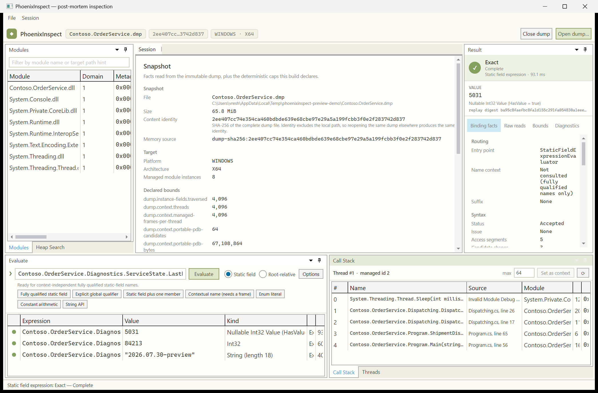

# PhoenixInspect Hosts

Status: Current · Active. Type: Guide.

PhoenixInspect ships two hosts over the same implemented contracts. Both open one dump read-only and present it as an
inspectable session: modules, threads and frames, rooted objects, and C# expressions answered from the values and
objects the snapshot actually contains.

| Host | Project | Use it for |
|---|---|---|
| Console | [`src/PhoenixInspect.Cli`](../src/PhoenixInspect.Cli) | Scripted and interactive sessions, transcripts, CI. |
| Desktop shell | [`src/PhoenixInspect.Desktop`](../src/PhoenixInspect.Desktop) | Browsing a dump interactively in a docked, ILSpy-style workspace. |

Neither host adds analysis of its own. Every fact both render comes from an existing public contract by way of
[`src/PhoenixInspect.Inspection`](../src/PhoenixInspect.Inspection), the shared host-independent projection layer, and
is rendered verbatim — including the product's own status, issue, completeness, evidence, bound, and diagnostic
vocabulary. Cross-cutting behaviors live there too, never in a host: Portable-PDB candidate parsing, discovery, and
the bounded explicit-first merge (`SourceNavigationService.ParseCandidateList` /
`AssemblePortablePdbCandidates`), the module-list filter contract (`ModuleRow.Matches`), and the single statement of
which source-verification outcomes permit showing content (`SourceViewResult.IsContentDisplayable`). A host decides
layout, selection, and phrasing — everything a host *computes* is available to any API consumer.

## The resemblance, and where it stops

A dump is not a live process. The hosts deliberately borrow a debugger's shape because that is the shape a
post-mortem user already thinks in, but the resemblance is presentational. Nothing resumes, mutates, or infers past
execution; every value is read from the snapshot under explicit bounds. Where a live debugger would simply evaluate,
PhoenixInspect reports what the evidence supported: an exact value, an exhaustively proven absence, a bounded partial
read, or a typed stop with a stable diagnostic code.

## Console host

```text
dotnet run --project src/PhoenixInspect.Cli -- <path-to-dump.dmp>
```

With no `--eval`, `--command`, or `--script`, the session starts an interactive prompt. `help` lists the commands.

| Option | Effect |
|---|---|
| `--eval <expression>` | Evaluate one expression, then continue. May be repeated. |
| `--command <text>` | Run one session command. May be repeated; order is preserved. |
| `--script <path>` | Run session commands from a file, one per line; `#` starts a comment. |
| `--verbose` | Print the complete evidence behind every answer. |
| `--no-color` | Suppress ANSI styling. |

Exit codes are `0` for a completed session, `2` for a usage error, `3` when the dump could not be opened exactly, and
`4` when a scripted command was rejected or could not run. A non-exact *answer* is not a failure and does not change
the exit code: it is a reported limit of the evidence, and the session summary counts it separately.

## Desktop shell

```text
dotnet run --project src/PhoenixInspect.Desktop -- <path-to-dump.dmp>
```



The path argument is optional; a dump can also be chosen through **File → Open dump…**, re-opened from
**File → Open recent** (the last ten opened paths, persisted across sessions), or dropped onto the window.
The shell is an Avalonia application built on the same UI stack as the ILSpy frontend — Dock for tool-window docking
and AvaloniaEdit for source text — with a light color scheme built around olive, khaki, sage, and gray; peach is
reserved for error conditions. Opening a dump itself still requires Windows because ClrMD dump loading does.

Only one session is open at a time, and every adapter call runs on one dedicated worker thread. The ClrMD adapter
exposes an immutable snapshot but does not promise concurrent use, so both hosts serialize access rather than
introducing a usage pattern the libraries do not support.

The workspace is docked the way ILSpy and a debugger are: the call stack and the tabbed Modules / Heap Search tools
dock left, documents fill the center, the evaluation console docks at the bottom, and the evidence pane docks right.
Every tool window can be resized, re-docked, or floated through the dock chrome. The center is a real document area:
a non-closable Session start page shows the snapshot facts and the honest statement of the supported surface, and
each resolved source file opens as its own closable tab. Opening a dump probes thread ordinals automatically, so the
stopped threads are visible without a manual step; the probe stays re-runnable with its caps from the Call Stack
header.

| Pane | Contracts exercised | What it shows |
|---|---|---|
| Call Stack | `SelectExpressionFrame` | Bounded managed frames with the declaring type and method name resolved from snapshot metadata, plus their MethodDef/TypeDef tokens, declaring namespace, IL offset, and instruction pointer. Double-clicking an exact frame adopts it as the static-field name context and opens its source document. |
| Locals | `DescribeFrameVariables` | The selected frame's parameters (including `this` for an instance method) and its IL local variable slots, decoded like Visual Studio's Locals window: parameter names from the module's Param rows, slot types from the method body's local signature in dump memory, and slot names from the identity-validated Portable PDB's local scopes, with out-of-scope and debugger-hidden slots marked. Values are deliberately not shown — the adapter publishes no register or stack-slot mapping, and the pane says so instead of guessing. |
| Source documents | `ResolveFrameSourceLocation` | One tab per resolved file: the document and line span the build recorded for the selected frame, resolved through an identity-validated Portable PDB. Verified content renders in a read-only editor with C# syntax coloring, line numbers, and the mapped span highlighted; a missing, mismatching, unverifiable, or over-bound file is a distinct plain-language explanation instead of content. |
| Modules | `Modules`, `ReadModuleContentIdentity` | Every managed module instance with its reported length and image layout. Selecting one reads its counted metadata from dump memory and reports the MVID, counted length, metadata digest, raw reads, and applied bounds. |
| Heap Search | `FindStrongHandleObjectsByTypeName` | A bounded strong-handle search over an exact ordinal type-name predicate, with the traversal counters and caps that say how exhaustive the result actually was. A match can be adopted as an expression root. |
| Evaluate | `StaticFieldExpressionEvaluator`, `DumpExpressionEvaluator` | Both implemented expression entry points behind one immediate-window-style input, with a watch-style history grid. Selecting a history row drives the evidence pane. |
| Watch 1 | `ExpressionEvaluationService.EvaluateWatch` | Editable watch expressions, like Visual Studio's Watch window: every row's expression edits in place, the trailing row adds a new watch, and rows re-evaluate when the adopted frame context, root, or root identifier changes. Which entry point answers is the API's single lexical rule — an expression referencing the adopted root's identifier evaluates root-relatively, everything else through the static-field path — and each row keeps its complete report. Compound values — arrays and tuples — expand into `[i]` and `ItemN`/named child rows realized by the report itself, recursively for nested compounds and bounded with an honest tail row. Expressions survive dump close and reopen. |
| Result | — | The complete evidence behind the selected answer: status, stage, value, binding facts, raw reads, applied bounds, stable diagnostics, and canonical replay digest. |

## Source, verified before it is shown

A frame's source location is resolved from a Portable PDB whose identity is validated against the mapped module's
CodeView record, exactly as in the static-field context path: a file with the right name is not evidence. Candidates
come from two places — paths offered explicitly (the console host's `pdb <path>`, the shell's evaluation options) and
paths derived from target-side module hints that exist on the analysis machine (the console host's `pdb auto`; the
shell probes them automatically). Every candidate is content-hashed and identity-checked before use.

Resolution answers with the build-recorded document path and the line span of the closest preceding non-hidden
sequence point for the frame's IL offset. Before presenting any file content as that source, the host requires the
on-disk bytes to reproduce the PDB's document checksum. A file that hashes differently is reported as a mismatch and
deliberately not rendered, because a similar-looking file presented as the captured code would be fabricated
evidence — the same rule every other panel follows for values.

When the recorded file cannot be produced locally, two PDB-backed fallbacks are tried before decompilation, in
order of evidential strength:

1. **Embedded source.** If the identity-matched PDB embeds the document's source (the compiler's
   `EmbeddedSource` custom debug information), those bytes are shown directly — they are build-time artifact
   content on the same footing as the line mapping itself, and they are checksum-verified when the document
   records a verifiable algorithm.
2. **SourceLink.** If the PDB carries a [SourceLink](https://github.com/dotnet/sourcelink) document map, the
   desktop shell maps the recorded path to its HTTPS URL and fetches it. Downloaded bytes are shown **only**
   when they reproduce the PDB's document checksum, byte for byte — a URL serves whatever it serves today, so
   the checksum is the entire admission criterion. The fetch is an explicit host capability (the shell enables
   it; headless resolution defaults to off).

## Selecting an expression root

The root-relative path needs one exact object. Two supported sources are offered, because the strong-handle catalog
alone cannot reach an object that no handle roots:

1. A match from a bounded strong-handle search, bound through `DumpQueryRootBinding.FromExactObject`.
2. The exact object value of a static-field expression, projected through
   `ClrmdDumpSession.ProjectExactObjectForInstanceEvaluation` and bound through
   `DumpQueryRootBinding.FromObjectBinding` so its authoritative typed provenance is preserved rather than restated as
   a handle.

The second source makes a static field the practical entry point into instance evaluation: evaluate
`Some.Namespace.Type.Instance`, then adopt the resulting object and evaluate members relative to it. In the console
host that is `root Some.Namespace.Type.Instance`, after which `root.Member` evaluates against that object.

## Reading a result honestly

Neither host reduces an outcome to success or failure. Each result carries:

- the product's terminal **status** and the **stage** it was reached at;
- the **value**, or an explicit statement that no value was produced;
- **binding facts** for every stage that ran, including counts of attempted name expansions, located candidates, and
  rejected declarations;
- **raw reads** with requested versus observed byte counts, so a partial read is visible as a partial read;
- only the **deterministic bounds actually reached**, never bounds that guarded an unvisited path;
- **stable diagnostic codes** for any non-exact outcome;
- a **canonical replay digest** where the contract publishes one.

An exhaustively proven absence and a bounded partial answer are shown as distinct outcomes, because the product treats
them as distinct and conflating them would misrepresent its result axes.

## Known limits

- The adapter selects one frame at a time by snapshot-scoped ordinal and publishes no thread count. Both hosts
  therefore probe ordinals, and state explicitly that they cannot distinguish a past-the-end ordinal from a live
  thread with no managed frames: both return the same typed unavailable observation.
- Thread ordinals are not stable between runs of the same program. The console host can therefore select a frame by
  method name, which is stable, but a frame whose module metadata is not completely present in the snapshot stays
  explicitly unnamed and cannot be selected that way.
- The observable value domain is limited to what the product admits: null, `Int32`, `Nullable<Int32>`, bounded
  strings, and validated object references. Anything else surfaces as a typed stop.
- Source viewing needs the identity-matching Portable PDB and the exact source bytes on the analysis machine. The
  mapping can be exact while the local file is missing or has drifted; both are reported as such, and neither is
  papered over by rendering whatever file happens to be at the recorded path.
- Interactive exploration is not a validation tier. The [`integration test plan`](proposals/integration-test-plan.md)
  remains the authority on what has been proven.
