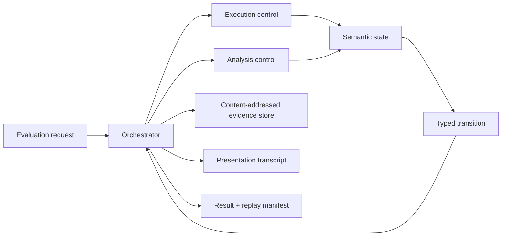

# Design and Architecture Review

## Document status

| Field | Value |
|---|---|
| Review date | 2026-07-13 |
| Review scope | Product goals, semantic model, architecture, prototype, project structure, roadmap, testing, governance, security, and operational plausibility |
| Repository phase | Conceptual design with a narrow executable walking skeleton |
| Decision | **Conditional GO** for the dump-time evaluator thesis; **NO-GO** for freezing the current APIs, expanding to all proposed products, or executing the current roadmap unchanged |
| Intended audience | Project owner, language/runtime designers, debugger engineers, and future contributors |

This is a review, not a replacement specification. Its recommendations should be converted into a small set of accepted decision records and normative specifications before the existing draft contracts are treated as stable.

## 1. Executive verdict

The project has a real and differentiated product at its center:

> Evaluate useful expressions and selected managed code against an immutable, incomplete .NET process snapshot, under deterministic resource limits, while making missing evidence, assumptions, approximations, and possible effects visible.

That product is technically plausible. ClrMD can expose runtime, heap, stack, and module facts; PE/PDB readers can supply code and debug metadata; a purpose-built IL interpreter can execute a deliberately closed subset; and an immutable snapshot plus virtual overlay is a sound architectural basis for counterfactual evaluation. The documentation also contains unusually strong instincts about provenance, deterministic replay, structured uncertainty, backend isolation, and fail-closed behavior.

The current program is not yet a plausible execution plan. It attempts to design, in one sweep:

- a dump-time expression evaluator;
- a virtual post-mortem debugger;
- a concrete IL runtime;
- a hybrid and abstract interpreter;
- speculative live-debugger evaluation;
- a no-JIT sandbox host;
- async and `dynamic` semantic runtimes;
- decompiler-backed source stepping;
- collection/query projections; and
- a general reusable analysis platform.

Those are related products, not one MVP. More importantly, the documents currently mix four incompatible semantic promises: exact virtual execution, counterfactual snapshot execution, interactive scenario exploration, and sound may-overapproximating analysis. A single status such as “exact,” “partial,” or “best effort” cannot describe all four. The canonical state, transfer contracts, stepping rules, model semantics, result schema, and roadmap consequently contradict one another in places.

The prototype is healthy as a plumbing spike but does not validate the central technical risk. It proves that a test can create a dump, ClrMD can enumerate a managed module, SRM can reopen a same-machine PE file, and the interpreter can remove a synthetic root frame for a one-byte `ret`. It does not reconstruct an active frame, read heap state from the dump, bind a runtime module to a validated artifact, initialize arguments or locals, or execute a meaningful expression.

The recommended decision is therefore:

1. Continue the project.
2. Make the dump-time evaluator the only committed product until it earns expansion.
3. Replace the current roadmap with a dump-memory-first sequence.
4. Separate execution profiles and result guarantees before extending APIs.
5. Treat the present public contracts as disposable sketches.
6. Prove a real field/array/string read from a dump before building abstract interpretation, virtual stepping, async, `dynamic`, decompiler maps, or broad semantic projections.

The project should not be cancelled; it should be narrowed and made more rigorous. The cost of doing that now is low because the implementation is still small.

## 2. Review method and evidence

The review covered the repository's root documentation, the complete design index, the architecture, product, integration, planning, governance, and library-notes documents, all handwritten source and test code, project files, and the solution build graph.

The evidence base included:

- 56 pre-existing Markdown documents, approximately 16,700 lines in total;
- 42 source projects and two test projects;
- 84 handwritten source files containing approximately 1,633 lines;
- two handwritten test files containing approximately 248 lines;
- the executable integration path and its target program;
- a clean sequential Release rebuild and the full test run;
- package, SDK, CI, analyzer, and restore configuration; and
- current primary-source documentation for .NET support, dump contents, artifact acquisition, hash stability, ClrMD, Roslyn's expression evaluator, and ILSpy.

The review used three independent passes: semantic/architecture consistency, product/scope/roadmap plausibility, and prototype/code/build analysis. Their conclusions were then reconciled against the repository itself.

### 2.1 Verified repository snapshot

| Measure | Observed state |
|---|---|
| Source projects | 42 |
| Test projects | 2 |
| Source projects containing handwritten C# | 8 |
| Empty source project shells | 34 |
| Handwritten source | 84 files / about 1,633 lines |
| Handwritten tests | 2 files / about 248 lines |
| Executed tests | One xUnit integration test |
| Clean Release rebuild | Succeeded sequentially; 98 warnings, no errors |
| Test run | Succeeded; 1 passed, 0 failed |
| SDK selection | Unpinned; the machine selected .NET 11 preview |
| CI | None found |
| Central package management | None found |
| Locked restore | None found |
| Public API/analyzer gate | None found |

Ninety-seven clean-build warnings are CS1591 documentation warnings. The remaining warning is a nullable-value flow issue in `ClrmdDumpSession`. This matters because the repository explicitly requires detailed XML documentation for public prototype APIs, but the build does not enforce that policy.

### 2.2 What this review did not establish

The repository has no representative corpus or benchmark suite, so this review cannot validate the proposed coverage or latency numbers. It also cannot establish ClrMD behavior across all dump kinds, target architectures, runtime versions, single-file applications, ReadyToRun images, NativeAOT, multiple loader contexts, or cross-machine artifact resolution. Those should become explicit compatibility experiments rather than implicit assumptions.

## 3. What is strong and should be preserved

The design should be revised around its strongest ideas, not restarted indiscriminately.

### 3.1 The problem is concrete and valuable

Dump debugging loses the debugger's ability to execute arbitrary target code. Users still need to navigate object graphs, evaluate conditions, inspect computed state, and ask counterfactual questions. Existing dump tools expose raw state well, but there is room for a trustworthy evaluator that can explain why an answer is exact, partial, assumed, or unavailable.

### 3.2 Immutable backing state plus virtual overlay is the right foundation

The proposed separation between a frozen dump and virtual writes is one of the architecture's best decisions. It prevents accidental mutation of evidence, supports repeatable counterfactual branches, makes undo cheap, and allows the product to distinguish observed facts from invented state.

The invariant should be stronger and normative:

> Snapshot bytes and decoded snapshot facts are immutable. Every write is represented in a branch-local overlay whose origin and lifetime are explicit. No model may silently mutate snapshot evidence.

### 3.3 Unknowns and provenance are product outputs, not implementation failures

The documents correctly recognize that sparse dumps, optimized code, absent locals, mismatched binaries, unsupported layouts, unresolved calls, and bounded execution are normal. Preserving these causes in structured form is essential. This is the project's most important trust differentiator.

### 3.4 Backend isolation is directionally correct

The core execution projects do not directly depend on ClrMD or SRM. Heavy dependencies are kept in leaf adapters. That is a good boundary, even though the current neutral contracts need redesign and the chosen metadata backend is contradictory across documents.

### 3.5 Deterministic limits and replay are the correct safety mechanism

Instruction, allocation, fork, call, traversal, model, trace, and analysis limits are more reproducible than wall-clock cancellation. Cancellation remains necessary for host responsiveness, but it cannot replace semantic fuel. The design is right to emphasize deterministic replay; it now needs a complete replay manifest and deterministic identifiers.

### 3.6 Differential execution is an excellent validation strategy

For supported concrete IL, running controlled methods both on the CLR and in the interpreter is the strongest practical oracle. This should be expanded to include normal results, exceptions, side effects, evaluation order, EH, generic instantiations, and supported call models.

### 3.7 The prototype is still cheap to change

The source is small, readable, and visibly draft-oriented. The project has not accumulated a compatibility burden. This is precisely the moment to replace weak public shapes, consolidate project boundaries, and reverse the roadmap.

## 4. Plausibility of the declared goals

The following scorecard separates the underlying technical possibility from plausibility within the proposed near-term program.

| Capability | Technical feasibility | Program plausibility now | Conditions |
|---|---:|---:|---|
| Read fields, arrays, strings, primitive values from supported dumps | High | High | Validated runtime/artifact identity, sparse-memory outcomes, layout/version gates |
| Evaluate a small read-only expression grammar | High | High | Deliberately small binder and slot/type model; no claim of full C# |
| Execute a closed concrete IL subset under deterministic limits | High | Medium-high | Normative transitions, complete frame state, EH included in the first closed slice |
| Conservatively admit selected getters/helpers | Medium-high | Medium | Replace “provably safe” with an auditable admission policy and explicit effect assumptions |
| Virtual IL/PDB stepping with linear undo | Medium-high | Medium | Event-driven stop plans, activation identity, complete return/EH semantics |
| Statement stepping over decompiled code | Medium | Low-medium | Heuristic quality labels, versioned decompiler settings, no statement-accuracy promise |
| Shared concrete and abstract interpreter | Medium | Low-medium | Separate semantic lattice state from operational control/evidence; prove laws first |
| Sound may-analysis over a defined IL subset | Medium | Low | Formal support boundary, containment tests, monotonicity, widening, resource-exhaustion semantics |
| Collection projections and query helpers | Medium-high | Medium | Residual unknowns preserved; projections must not masquerade as complete mutable objects |
| Completed-task async lifting | Medium-high | Medium | Persistent activation/continuation model; limited awaiter matrix |
| Pending external async progression | Low-medium | Low | Explicit scenario assumptions; never invent external progress as observed execution |
| Restricted `dynamic` dispatch | Medium | Low | Runtime-binder inputs and candidate effects modeled; Roslyn static binding is not equivalent |
| Broad no-JIT sandbox/runtime host | Low-medium | Very low | Separate product, threat model, compatibility plan, and substantially larger runtime surface |
| One engine serving dump, static, live, sandbox, replay, and build-time products | Possible eventually | Not credible as one roadmap | Treat non-dump products as incubation and architecture stress tests |

### 4.1 The corrected product claim

The project should describe itself as a **bounded counterfactual evaluator over partial evidence**, not as a generally safe managed-code execution environment.

“Safe,” “pure,” and “exact” are overloaded:

- Safe for the host does not mean semantically faithful to the target.
- No snapshot mutation does not mean no virtual side effects.
- A method judged effect-free by a conservative policy is not mathematically proven pure for every runtime and input.
- A concrete result can be exact relative to assumed artifacts while still be incomplete relative to the original process.
- An abstract result can be sound for a declared subset without being precise.

A more defensible promise is:

> The evaluator either produces an answer under a named execution profile and evidence manifest, or stops with a structured explanation. It never silently upgrades missing evidence or scenario assumptions into observed facts.

## 5. Principal architectural finding: four semantic products are conflated

The design currently asks one machine state and one result vocabulary to serve four distinct semantics.

| Profile | Question answered | Branching | Missing/external input | Guarantee |
|---|---|---|---|---|
| `VirtualConcrete` | “What does this supported IL do in this fully represented virtual state?” | CLR-determined | Blocks or fails with a typed reason | Concrete fidelity for the declared supported subset |
| `SnapshotCounterfactual` | “What would this code compute if run from the observed snapshot under these frozen-environment rules?” | CLR-determined where evidence exists | Produces structured unknowns or stops | Exact relative to evidence and explicit frozen-environment assumptions |
| `ScenarioExplore` | “What outcomes follow if the user chooses these missing values, scheduler events, or policies?” | User/policy choices | Explicit assumptions and decision nodes | Conditional results, not claims about the captured process |
| `MayAnalysis` | “What results or effects may be possible for all states represented here?” | Finite successor sets | Sound overapproximation for the declared subset | Soundness claim with precision/completeness qualifiers |

These profiles may share decoding, identity, memory abstractions, opcode helpers, diagnostics, and model infrastructure. They must not share an ambiguous semantic contract.

### Required decision

Add an `ExecutionProfile` to every request, transition, model invocation, trace, and result. Define admissible degradation for each profile. For example:

- `VirtualConcrete` must not turn an unsupported opcode into an arbitrary `Top` value.
- `SnapshotCounterfactual` may propagate a missing-field unknown if stack shape, control flow, exceptions, and effects remain well-defined.
- `ScenarioExplore` may ask for a value or event, but must record the answer as an assumption.
- `MayAnalysis` may overapproximate, but budget exhaustion must widen or summarize rather than silently discard successors.

Without this split, words such as exact, safe, deterministic, confidence, and supported will continue to drift across documents.

## 6. Critical findings requiring redesign before API expansion

### 6.1 [P0] The roadmap validates the core product last

The current sequence in `plans/future-work-planning.md` places concrete/hybrid stepping at M1, CFG/fixpoint analysis at M2, call models at M3, virtual stepping at M3.5, async and `dynamic` at M3.6, projections at M3.7, and actual dump-aware hosting at M4.

That order is backwards for the declared product. It spends most of the program designing reusable machinery before proving that a dump can provide enough trustworthy state to answer a useful question.

The decisive uncertainties are earlier and more prosaic:

- Can the host identify the correct runtime, module instance, metadata artifact, and method across realistic dumps?
- Which dump types contain the required bytes and heap segments?
- Can it distinguish absent memory from zero/default values?
- Can it decode representative object, array, string, and generic layouts across the supported runtime tuple?
- Can it reconstruct a useful active frame and IL offset?
- Can it report artifact mismatch and optimized-away state without false precision?

These should be answered before investing in an abstract interpreter or virtual debugger.

**Required action:** replace M0–M4 with the dump-first roadmap in section 13.

### 6.2 [P0] The transfer contract cannot represent the required outcomes

`IValueDomain`, `IMemoryModel`, and the current call model mostly return values or nullable records. That cannot faithfully represent CLR execution, missing evidence, or abstract successors.

A normative transition algebra should be introduced before more opcodes:

```text
Transition<TState> =
    Normal(non-empty successors)
  | Throw(exceptional successors)
  | Return(return value and caller continuation)
  | Suspend(async activation and continuation token)
  | Decision(explicit scenario alternatives)
  | Blocked(missing evidence, unsupported capability, or exhausted resource)
  | InvalidProgram(target IL/state invalidity)
  | EngineFailure(interpreter defect)
```

Each transition must carry:

- semantic state deltas or successors;
- finite may-effects;
- target exceptions separately from engine failures;
- diagnostics and evidence references;
- explicit assumptions;
- deterministic resource cost; and
- the instruction/event actually committed, if any.

Invalid combinations should be unrepresentable. A generic record with several nullable fields is not sufficient.

### 6.3 [P0] Canonical machine state and fixpoint state are incompatible

The canonical state proposal includes decreasing budgets, growing traces, evidence/provenance identities, scheduler history, and other operational data. Joining those fields at CFG merge points prevents convergence or makes equality depend on traversal order.

Split the runtime into five concepts:

1. **Semantic state** — values, locations, path facts, heap overlay, exception/control semantics; this alone participates in lattice order and fixpoint joins.
2. **Execution control** — current activation, instruction pointer, call/return continuation, stop plan, deterministic fuel.
3. **Analysis control** — worklist, visit counts, widening schedule, merge keys, fork limits.
4. **Evidence store** — content-addressed and deduplicated facts, unknown causes, artifact reads, assumptions.
5. **Transcript** — ordered user-facing events and diagnostics; never part of semantic equality.

Stable evidence references may appear in semantic values, but allocation order and presentation history must not. The domain contract needs `Bottom`, `Join`, `Widen`, and `LessOrEqual`, plus documented laws and stable semantic hashing.

### 6.4 [P0] Exception handling is deferred past the first supposedly useful IL slice

Ordinary C# patterns use EH even when users do not write `try`: `using`, `lock`, many `foreach` expansions, iterator disposal, and async state machines depend on `leave`/`finally`. Correct method calls also require exception propagation.

An interpreter that supports calls, branches, objects, or stepping without a coherent EH model is not semantically closed. EH cannot be an optional late opcode family.

The first interpreted-method milestone should include, for its closed subset:

- handler table decoding and validation;
- search and unwind phases;
- `throw` and `rethrow`;
- `leave` and pending-finally continuations;
- `endfinally` and `endfilter`;
- catch/filter/finally/fault rules;
- exception-object stack behavior; and
- propagation through modeled and interpreted calls.

This does not require every opcode, but it does require complete control semantics for accepted bodies. Admission should reject bodies whose EH behavior is outside the supported tier.

### 6.5 [P0] Resource-limit policy is contradictory

Some documents treat cancellation as the MVP substitute for instruction/time accounting, while the roadmap and determinism goals require hard deterministic budgets. Wall-clock timeouts vary with machine load, JIT warmup, I/O, and debugger overhead, so they cannot support replay.

The policy should distinguish:

- deterministic semantic limits: instructions, calls, recursion depth, allocations, virtual bytes, forks, merge iterations, model invocations, traversed objects/elements, trace bytes;
- host responsiveness: cancellation token and optional wall-clock watchdog;
- input limits: dump/artifact size, metadata table bounds, symbol/source download limits; and
- output limits: result graph, diagnostics, transcript, and serialized replay size.

Cancellation should produce a distinct host-cancelled result. Exhausting a semantic budget should identify the exact counter and deterministic consumption point. May-analysis must conservatively summarize remaining states rather than dropping them.

### 6.6 [P0] Several “semantic lifts” change user-visible behavior

The modeling documents propose replacements such as no-op monitor operations, simplified enumeration, elided disposal, interpolated-string substitution, and frozen environmental values. These may be useful, but they are not all semantics-preserving.

Three mechanisms must be separated:

1. **Presentation hiding** — execute exact semantics but collapse uninteresting internal frames in the UI.
2. **Verified replacement** — substitute an implementation only under machine-checkable preconditions, version constraints, and differential evidence.
3. **Scenario model** — intentionally approximate or replace behavior and record the assumption and possible omitted effects.

For example, treating `Monitor.Enter` as a no-op erases exceptions and synchronization state; skipping `Dispose` can erase user code; projecting a partial dictionary as complete can make lookups falsely negative. These are scenario semantics unless proven otherwise.

Model registration should declare profile applicability, preconditions, runtime/library version range, exactness class, effects, exceptions, and validation evidence. The orchestrator—not each adapter or model—should synthesize the final trust statement.

### 6.7 [P0] The result vocabulary mixes orthogonal properties

Terms such as `Exact`, `BestEffort`, `Partial`, and `UnsupportedLayout` mix result completion, evidence quality, fidelity, precision, soundness, and failure reason. The same result may be exact for a branch, incomplete due to an unread field, based on a user assumption, and still sound as a may-result.

Use one normative envelope:

```text
EvaluationResult =
  CompletionStatus
  ValueOrAbstractSummary
  SemanticStateDelta
  MayEffects
  Assumptions
  EvidenceManifest
  Completeness
  Fidelity
  SoundnessClaim
  PrecisionSummary
  Diagnostics
  ResourceUsage
  ReplayManifest
```

Suggested axes:

- **Completion:** completed, blocked, budget-exhausted, cancelled, invalid-target, engine-failure.
- **Completeness:** complete for request, partial value/state, no answer.
- **Fidelity:** observed, exact virtual, verified replacement, approximate model, user-supplied scenario.
- **Soundness claim:** none, concrete-for-supported-subset, may-overapproximation-for-declared-subset.
- **Evidence:** artifact hashes, runtime/module/frame identity, memory ranges, model rules, user assumptions.
- **Effects:** none, virtual-only, may-read, may-write-overlay, may-throw, may-block/synchronize, unknown.

“Confidence” may be a UI projection over these facts, but it must not replace them.

### 6.8 [P0] Identity and replay are not yet deterministic

Canonical semantic identity cannot be based on local paths, runtime string hashes, concurrent insertion order, or display metadata.

The current prototype violates this in several places:

- `SrmMetadataModule.ComputeStableHandleValue` uses `StringComparer.OrdinalIgnoreCase.GetHashCode(path)`. .NET does not guarantee stable string hash codes across processes or platforms, and a 32-bit hash is collision-prone.
- method handles are per-module sequential counters, so unrelated modules can produce the same handle;
- concurrent `GetOrAdd` allocation can depend on race order and consume losing counter values;
- `GenericContext` record equality compares ordinary list/array objects by reference rather than structural type sequence;
- `ModuleId` record equality includes display name and path hints, so the same MVID discovered differently compares unequal; and
- `MetadataResolutionServices` ignores the supplied module handle and resolves everything through one module.

Define separate identities:

- **Artifact identity:** content hash plus format-specific evidence such as MVID, assembly identity, PE timestamp/size, PDB identity.
- **Runtime module instance:** target runtime, loader context/assembly load context, base address, and validated artifact binding.
- **Entity identity:** runtime module instance or artifact plus metadata token and structural generic instantiation.
- **Activation identity:** stable call/async activation lineage, independent of traversal order.
- **Location identity:** activation+argument/local slot, object+field, array+indices, static storage domain+field, or explicit unmanaged/interior location.
- **Unknown identity:** derived from semantic cause and source location, not an incrementing counter.

Internal compact handles are fine, but they must map bijectively to canonical keys within a replay manifest and must never be mistaken for cross-session identity.

## 7. Important design findings

### 7.1 [P1] Async suspension lacks a coherent control-transfer model

The async proposal correctly recognizes lowered state machines but does not fully specify what happens to the current call activation at suspension. Suspension is not merely a special return value. The activation and continuation must survive after the kickoff path returns to its caller.

Introduce a persistent `AsyncActivation` with:

- state-machine object identity;
- current state and awaiter slot;
- captured execution context policy;
- continuation target and resumption token;
- parent/causal activation;
- virtual task identity and completion source; and
- provenance for any supplied completion.

Start with already-completed tasks/awaiters. For an incomplete external task, `SnapshotCounterfactual` should block with an external-progress requirement. `ScenarioExplore` may ask the user or policy to choose completion, fault, or cancellation, but that choice is an assumption. A rule that continuations are “always queued, never inline” is deterministic but not CLR-equivalent and must be labeled as scenario semantics.

### 7.2 [P1] Step Into/Over/Out predicates are statement-centric instead of event-centric

The proposed predicates can run too far or fail to stop:

- Step Over can execute an entire loop if control remains on the same source statement.
- Step Into can lose its “just entered” state while traversing hidden prologue instructions.
- Step Out can wait forever for a different statement even though the activation already returned to a caller mapped to the same statement.

Use activation-aware stop plans over interpreter events:

- call committed / callee activation created;
- activation returned or unwound;
- handler entered;
- async activation suspended/resumed;
- user-code stoppable anchor reached;
- decision or blocked state reached;
- breakpoint/watchpoint hit; and
- budget/cancellation/terminal event.

Each command needs precedence, zero-progress behavior, hidden-frame policy, and loop protection. Source maps should affect presentation and anchor selection, not define call/return truth.

### 7.3 [P1] Debug-map documents overclaim source precision

Portable PDB sequence points are useful anchors, but inferred end positions are display ranges, not proof that every IL instruction belongs to one language statement. Decompiled source mappings are still more heuristic and depend on ILSpy version, settings, transforms, and input artifacts.

Normalize debug ranges as half-open intervals and preserve:

- origin: portable PDB, Windows PDB, decompiler, inferred;
- artifact hash and document identity;
- tool/version/settings hash;
- one-to-many and many-to-one mappings;
- hidden/prologue/epilogue classification; and
- quality/fidelity flags.

Use encountered stoppable anchors for stepping. Do not promise “statement-accurate” behavior for decompiled maps.

### 7.4 [P1] The abstract domain is not yet an implementable reduced product

The canonical domain proposal lists useful components, but important laws and reductions remain undefined:

- `IValueDomain` lacks bottom and subsumption;
- type-set join and widening are not specified;
- interval, nullness, type, symbolic, taint, and provenance reductions are not defined;
- provenance allocation can make equal semantic states compare unequal;
- `ConditionInfo` captures value copies rather than stable symbols/locations, so refinement may not update aliases or state;
- taint/provenance is mixed into semantic value order; and
- generic reasoning contains a direction hazard: a runtime type `R` must be assignable to the static constraint/type `T`; it is not generally correct to require `T` to be a subtype of `R`.

Before M2-like work, write algebraic laws and executable property tests for a very small domain. Keep explanatory provenance in a deduplicated evidence graph and make semantic equality insensitive to evidence allocation order.

### 7.5 [P1] `dynamic` cannot be reduced to ordinary Roslyn static binding

The runtime binder depends on more than receiver and argument static types: runtime values/types, binder flags, calling context and accessibility, named arguments, conversions, `ref`/`out`, checked context, extension/import context, and runtime/library version can matter. Reconstructing a C# expression and asking Roslyn to bind it is useful evidence, not runtime-binder equivalence.

Restricted dynamic support should either:

- replay a sufficiently complete captured call-site/binder description through a compatible isolated binder adapter; or
- enumerate conservative candidates and join their values, exceptions, and effects.

If candidate enumeration is incomplete, the result cannot be advertised as a sound closed set.

### 7.6 [P1] Memory contracts omit necessary addressable locations and miss semantics

`IMemoryModel` lacks static fields, argument byrefs, array-element byrefs, static-field byrefs, interior struct locations, object/array allocation semantics, length, struct copy/init, and generic join/order operations. `MakeByRefToLocal(int)` lacks activation identity, so recursive frames would alias the same slot.

`IProcessMemoryReader.TryRead` returns only `bool`. Sparse dumps need at least bytes read, unread ranges, reason, source, and a guarantee about untouched destination bytes. “Missing,” “unmapped,” “unsupported layout,” “artifact mismatch,” “corrupt metadata,” and “engine I/O failure” are different outcomes.

Managed pointers must carry location kind, owning activation/object/static domain, exact type, lifetime, and read/write capability. Unsafe/native pointers should be a separate explicit tier.

### 7.7 [P1] Call-model contracts hide dependencies and allow invalid states

`CallModelContext` includes `IServiceProvider`, which is a service-locator escape hatch incompatible with auditable capabilities and replay. Mutable diagnostic sinks can emit side effects even when a model declines the call. `CallOutcome` represents multiple alternatives through nullable fields and lacks stable rule identity, consumed budget, branch predicates, provenance, and explicit state/effect invariants.

Pass a typed, immutable capability manifest. Make diagnostics and effects returned data. Use a closed outcome hierarchy, and require every model to declare its stable ID, version, profile applicability, preconditions, supported target versions, and deterministic cost.

### 7.8 [P1] Partial projections must preserve unknown residual state

A partially readable collection cannot safely become an ordinary complete `Dictionary` or sequence. Missing buckets, nodes, elements, comparer state, or mutation history can change membership, order, uniqueness, and exceptions.

A projection should expose known elements plus a residual such as “zero or more unread elements satisfying these constraints.” Operations must propagate that residual. For example, absence from known elements does not prove `ContainsKey == false` when unread buckets remain.

### 7.9 [P1] Unsupported-opcode degradation needs stack/control/effect knowledge

Injecting an unknown result for an unsupported opcode is valid only if the engine still knows:

- exact stack pop/push shape;
- possible exceptional edges;
- control-flow behavior;
- memory/effect behavior; and
- type/verifier consequences.

Otherwise the whole successor state is not defined. Opcode support should be a matrix by execution profile, value domain, host capability, and backend—not one global tier. Method admission should reject or conservatively summarize bodies whose unsupported operations invalidate control or effect semantics.

### 7.10 [P1] Environmental freezing is an assumption, not observation

Using dump capture time for `DateTime.UtcNow`, a fixed culture, synthetic random seed, or virtual scheduler may be useful and deterministic. None is automatically the value the target would have observed at a future counterfactual instruction. These belong in the explicit model/assumption manifest.

## 8. Product, scope, and planning findings

### 8.1 [P1] There is no single committed product boundary

The dump evaluator should be the committed product. Static analysis, speculative live evaluation, sandbox hosting, replay, differential testing, and build-time partial evaluation are legitimate future consumers and useful architecture stress tests, but they should not all drive MVP contracts.

Recommended portfolio labels:

- **Committed:** post-mortem read-only evaluation, then bounded interpreted helpers.
- **Next, conditional:** minimal virtual stepping over the proven execution subset.
- **Incubation:** may-analysis, `dynamic`, async progression, query projections, decompiler stepping.
- **Separate product proposals:** live speculation and sandbox/no-JIT runtime hosting.

### 8.2 [P1] The C# expression front end and host are hidden scope

The product proposal includes C# syntax, imports, statics, indexers, overload resolution, formatting, completion, and debugger-like context. That is a major subsystem. Roslyn's own expression evaluator is substantial, host-coupled code, not a parser switch. See the [Roslyn ExpressionEvaluator source](https://github.com/dotnet/roslyn/tree/main/src/ExpressionEvaluator).

Start with a deliberately small grammar and explicit semantics—for example literals, selected frame slots, field access, array indexing, equality/relational operators, Boolean operators, conditional expressions, and a small method-call admission surface. Choose one host, preferably an SDK plus CLI test harness, before promising an IDE-grade experience.

### 8.3 [P1] Success metrics are not grounded in a corpus

Coverage targets such as 70% have no denominator. Establish a versioned corpus of:

- supported dump kinds and runtime/architecture tuples;
- representative applications and compiler modes;
- concrete user questions;
- expected observed, partial, unavailable, and assumed outcomes; and
- adversarial/malformed artifacts.

Track:

- grounded-answer rate;
- complete/partial/unavailable distribution by reason;
- false-exact rate, which should be release-blocking;
- artifact-binding success and mismatch detection;
- deterministic replay rate across fresh processes;
- median semantic yield per resource unit;
- latency split into cold artifact acquisition, decode, and warm evaluation; and
- unsupported-opcode/model/layout frequencies from the corpus.

### 8.4 [P1] Performance targets are premature

Targets such as 5 ms or 30 ms can reward early blocking or aggressive unknown injection. First establish cold/warm baselines and measure semantic yield. Artifact discovery, symbol/source acquisition, dump page reads, metadata decode, expression binding, and execution should be reported separately.

### 8.5 [P1] Milestones are not estimable

The current plan has no staffing model, owners, effort ranges, dependency graph, critical path, or supported compatibility tuple. Exit criteria often describe documents rather than observable product behavior. Do not attach calendar commitments until the real dump-memory slice supplies empirical throughput and risk data.

Use evidence gates and relative tranche sizes first. After W0 and PM1, estimate subsequent work from measured adapter, corpus, and opcode/model costs.

### 8.6 [P1] Governance is proposed but not operating

Most documents remain Draft. The repository has no actual `docs/decisions`, normative `docs/specs`, owner/freshness metadata, or supersession mechanism, yet the roadmap proposes locking interfaces at M0.

The requirements traceability map is currently a bibliography: “covered” generally means a related document exists. Replace that with states such as Accepted, Designed, Test Planned, Implemented, and Validated, each linked to an exact decision/spec anchor, test/corpus case, owner, and last validation date.

### 8.7 [P1] Backend authority is contradictory

`docs/lib/mvp-backend-decision-record.md` provisionally chooses AsmResolver. Other architecture documents call SRM the default. The implementation uses SRM while the AsmResolver project is empty, and the roadmap still speaks as if the choice is open.

Write one superseding ADR. Either:

- implement the same capability spike through both backends and decide from contract-test evidence; or
- accept SRM as canonical for the first product slice and record exactly which AsmResolver capabilities remain candidates.

Do not maintain two implied primaries.

### 8.8 [P1] Compatibility, security, privacy, and artifact policy need gates

Dumps, PEs, PDBs, source files, SourceLink URLs, and model/plugin inputs are untrusted. Dumps also contain secrets. Before productization, define:

- one supported OS/architecture/runtime/dump-kind tuple;
- parser and decompression size limits;
- path traversal and archive extraction rules;
- network-off by default, with visible artifact fetch consent/policy;
- content-addressed cache and replayable fetch manifest;
- SourceLink URL/scheme/domain policy;
- secret-safe logs, diagnostics, crash reporting, and telemetry;
- plugin/model isolation and version pinning;
- malformed metadata/dump fuzzing; and
- retention/deletion policy for dumps, sources, caches, and traces.

Full dumps commonly contain module images, while heap and mini dump types may not; the product must expose dump capabilities and artifact needs explicitly. Microsoft documents the dump-type differences in [`dotnet-dump collect`](https://learn.microsoft.com/en-us/dotnet/core/diagnostics/dotnet-dump), and [`dotnet-symbol`](https://learn.microsoft.com/en-us/dotnet/core/diagnostics/dotnet-symbol) illustrates that cross-machine module/symbol acquisition is a separate concern.

## 9. Prototype and code audit

### 9.1 [P0] The integration test does not interpret dump state

The target calls `RetOnly()` before printing `READY`, then sleeps. The dump is captured only after `READY`, so `RetOnly` is not an active frame. The test then locates a module by filename, reopens the recorded local file path, finds a method by simple names, reads its IL from disk, constructs a fresh synthetic machine state, and executes it independently of the dump's frames, arguments, locals, heap, and memory.

The MVID comparison is between PE files opened from disk; it does not validate binding from a specific runtime module instance in the dump to an artifact. The semantic half would succeed for a dump that merely enumerated a same-named module at a usable same-machine path.

This remains a useful smoke test for:

- full-dump creation in the test environment;
- ClrMD session creation;
- managed-module enumeration;
- local PE opening through SRM; and
- a root static-void `ret` microstep.

It should be named and documented as that proof. The updated integration-test plan now does so.

The next integration slice should hold a method active at capture and derive from the dump:

1. exact runtime/module/method identity;
2. frame instruction offset;
3. argument and local slots where recoverable;
4. at least one object field, one array element, and one string;
5. structured missing-memory and artifact-mismatch cases;
6. initial interpreter state; and
7. a trace hash stable across fresh processes.

Then execute a small branchy body containing `ldarg`, `ldloc`, `ldfld`, a conditional branch, and `ret`.

Relevant files:

- `tests/Interpreter.TestTarget/Program.cs`
- `tests/Interpreter.IntegrationTests/RetOnlyDumpIntegrationTests.cs`
- `src/Interpreter.Host.Dump.ClrMD/ClrmdDumpSession.cs`
- `src/Interpreter.Metadata.SRM/SrmMetadataModule.cs`
- `src/Interpreter.Core.Execution/IlMachine.cs`

### 9.2 [P0] Current core contracts cannot represent the documented state

Examples:

- `IValueDomain` lacks bottom and subsumption, and its arithmetic/conversion APIs return only values even though supported operations may throw target exceptions. `BinaryOp` cannot distinguish checked/unchecked or signed/unsigned variants such as `add.ovf.un`, `div.un`, `clt.un`, and `cgt.un`; `ConvOp` cannot express all source-interpretation distinctions such as `conv.r.un`.
- `IMemoryModel` lacks semantic join/order operations as well as static fields, argument/array/static byrefs, array length, interior struct locations, and typed copy/init behavior.
- `FrameState` contains only method, IL offset, and evaluation stack. It has no module, arguments, locals, `this`, return continuation, exception state, activation identity, or generic context.
- `MachineState` contains only call stack, memory, and budget. It omits path facts, effects, evidence, profile, execution control, and replay identity.
- `MethodBody` contains max stack and raw bytes but no local signature, `initlocals`, EH clauses, decoded instruction boundaries, token fixups, or provenance.
- `FrameSeed.LocalsByName` uses display names as semantic identity, although names can be missing, duplicated, or shadowed.
- `ExternalValue` is too weak for the complete IL value-type and location model.
- resolver virtual dispatch returns one target where abstract execution may require a candidate set.
- `IBudgetPolicy` consumes only instructions and allocations although `BudgetState` also advertises call/fork limits; budget state is passed by value to models without a returned consumed-budget delta.
- `UnknownOrigin` is an enum plus free-form text and cannot carry a stable semantic cause, source/artifact read, confidence, related call site, or replay identity.
- `SequencePoint.IlEndOffset` is described as inclusive or inferred depending on backend; the neutral contract should mandate one convention, preferably half-open `[start, end)`.

These types should not be stabilized or expanded incrementally. Replace them after the normative state/transition specification.

### 9.3 [P1] `IlMachine` reports instructions that were not executed

Budget exhaustion, missing method bodies, invalid offsets, and unsupported opcodes currently produce `InstructionExecuted`. No instruction was committed in those cases. Missing evidence, invalid target state, unsupported capability, budget stop, target exception, and interpreter defect are also collapsed into a broad fault outcome.

The `ret` implementation only removes the top frame. It does not validate the signature, pop a return value, place it on the caller stack, or resume a caller continuation. It is correct only for the tested synthetic root static-void case.

Define the typed transition/event vocabulary first. Only a committed instruction should emit an executed event.

### 9.4 [P1] Adapter APIs overstate their capabilities

`SrmMetadataModule` implements the full metadata interface but throws `NotSupportedException` for most members. Its lookup ignores namespace, arity, overload, and signature; its `TryGetMethodBody` can still throw for malformed inputs; and constructor failure can leak the opened stream. That is acceptable for an explicit ret-only spike, not a general provider.

`ClrmdDumpSession` publicly exposes concrete `ClrRuntime`, selects the first CLR, treats recorded target paths as usable local paths, resolves same-filename modules by first match, and lacks deterministic runtime/module selection or artifact validation. If session creation fails after opening `DataTarget`, cleanup is not assured.

Adapters should publish a capability manifest and structured miss results. Concrete third-party types should remain behind the boundary unless the host explicitly opts into that adapter.

### 9.5 [P1] The integration harness can hang on its failure path

On startup timeout or unexpected output, the test calls synchronous `StandardError.ReadToEnd()` before terminating the still-sleeping target. EOF will not arrive while the target is alive, so the error path can block beyond its intended timeout. Kill/cancel first, capture output asynchronously with bounds, await exit, and add an overall test timeout.

### 9.6 [P1] The physical project graph precedes validated boundaries

Thirty-four of 42 source projects contain no handwritten C#. This imposes restore, build, ownership, dependency, and navigation costs without validating responsibility boundaries. Some encoded references already disagree with the module proposal.

Keep the detailed logical module map as a design inventory, but consolidate the executable spike into approximately 6–10 capability-oriented assemblies until code, contract tests, independent versioning, or deployment constraints justify splits.

### 9.7 [P2] Build and dependency governance is not reproducible

There is no `global.json`, so the machine selected .NET 11 preview to build a `net8.0` solution and emitted preview-SDK notices. There is no central package file, lock file, CI workflow, analyzer configuration, or public API baseline. Package versions are pinned independently and several are old enough to require deliberate compatibility review.

As of this review, .NET 8 is in maintenance and reaches end of support on 2026-11-10, while .NET 10 LTS is supported into 2028. See the [official .NET support policy](https://dotnet.microsoft.com/en-us/platform/support/policy). For a multi-year effort, pin a stable .NET 10 SDK unless an explicit supported-client constraint requires multi-targeting .NET 8.

Do not blindly update dependencies. Establish adapter contract tests, then evaluate current stable ClrMD, SRM, ILSpy, Roslyn, AsmResolver, and test SDK versions. ClrMD is an introspection library rather than an evaluator, so its version and supported runtime matrix should be treated as an adapter compatibility concern; see the [ClrMD repository](https://github.com/microsoft/clrmd). ILSpy/decompiler behavior must likewise be version/settings-pinned; see the [ILSpy repository](https://github.com/icsharpcode/ILSpy).

### 9.8 [P2] Public documentation policy is not enforced

`GenerateDocumentationFile` is enabled while `TreatWarningsAsErrors` is false. The clean build produces 97 CS1591 warnings. Either keep spike-only types internal or enforce CS1591 for product source, with complete parameter, return, law, and draft-caveat documentation. Add analyzers and an API baseline before exposing a reusable SDK.

## 10. Recommended normative architecture

### 10.1 Request, transition, and result

Every evaluation should begin with immutable, serializable inputs:

```text
EvaluationRequest =
  ProgramIdentity
  InitialSemanticState
  ExecutionProfile
  CapabilityManifest
  ResourceLimits
  ModelManifest
  ExplicitAssumptions
  RequestedObservations
```

The execution core emits the transition algebra from section 6.2. The orchestrator converts terminal transitions and accumulated evidence into the result envelope from section 6.7.

The request, model/capability versions, artifact hashes, assumptions, deterministic limits, and stable identity map form the replay manifest. Wall-clock timing and presentation ordering do not participate in semantic replay equality.

### 10.2 State decomposition



Only semantic state is ordered/joined. Execution and analysis control determine how states are explored. Evidence is deduplicated and referenced structurally. The transcript is an output view.

### 10.3 Semantic-state invariants

At minimum:

1. Every activation has a stable identity.
2. Every instruction pointer is a validated instruction boundary in a specific method body artifact.
3. Evaluation stacks satisfy the verifier/category model at accepted instructions.
4. Arguments, locals, and managed pointers are slot/location based, never name based.
5. Byrefs include owning activation/object/static/array identity, type, and lifetime.
6. Target exceptions are distinct from missing evidence, unsupported capability, invalid IL, cancellation, and engine failure.
7. Snapshot evidence is immutable; writes go to branch-local overlays.
8. Semantic equality excludes transcript order, evidence allocation order, wall-clock time, and counters used only for presentation.
9. Analysis exhaustion overapproximates remaining behavior rather than deleting it.
10. Exact replacements validate all declared preconditions and target-version constraints.
11. User choices, scheduler progress, clocks, randomness, culture, and external completions are explicit assumptions unless directly evidenced.
12. Every result can be traced to a complete replay manifest.

### 10.4 Suggested physical architecture during discovery

Do not equate every logical responsibility with an assembly yet. A reasonable discovery-phase shape is:

1. **Foundation.Contracts** — stable identities, capabilities, structured outcomes, provenance, result/replay schema.
2. **Artifacts.Metadata** — neutral metadata/IL/PDB contracts and content-addressed artifact resolution; SRM/other adapters as leaf assemblies where third-party isolation is required.
3. **Snapshot.Runtime** — dump/runtime/frame/heap adapters, sparse-memory model, snapshot decoding, virtual overlay.
4. **Execution.IL** — decode/validation, concrete semantic state, transitions, calls, EH, budgets.
5. **Analysis** — abstract domains, CFG/worklist/fixpoint, widening; depends on semantic operation contracts without contaminating concrete state.
6. **Models** — typed/versioned call and projection models, split further only when dependency or release boundaries require it.
7. **Host/Products** — expression front end, orchestration, CLI/SDK, formatting, debugger UI integrations.

This is a target grouping, not an API commitment. External adapters may remain separate assemblies, but empty placeholders should not dictate the architecture.

### 10.5 Artifact and dump pipeline

The real pipeline should be:

```text
Dump input
  -> bounded validation and capability inventory
  -> explicit runtime selection
  -> runtime module-instance inventory
  -> artifact discovery/acquisition
  -> content/identity validation
  -> metadata/IL/PDB capability inventory
  -> frame/heap/memory facts with structured holes
  -> snapshot semantic state
  -> expression binding or method admission
  -> bounded evaluation
  -> result/evidence/replay manifest
```

Recorded target paths are hints, never identity. Artifact acquisition must be visible and reproducible. Network access should be disabled by default for untrusted dumps and enabled only through an explicit policy.

## 11. Testing and validation strategy

The current strategy emphasizes determinism and provenance but needs stronger correctness and soundness oracles.

### 11.1 Contract/property tests

- lattice identity, commutativity, associativity, idempotence, monotonicity, and widening convergence;
- semantic hash/equality independence from traversal and evidence-allocation order;
- structural generic-context equality;
- cross-module and cross-loader-context identity separation;
- managed-location aliasing and lifetime laws;
- overlay read-after-write, branch isolation, join, and snapshot immutability;
- budget boundary behavior for every resource counter;
- structured miss classification and destination-buffer guarantees;
- model determinism, precondition enforcement, effect containment, and decline-without-side-effects.

### 11.2 CLR differential tests

For every admitted concrete opcode/body family, compare:

- value and bit-level numeric behavior;
- target exception type and timing;
- evaluation order;
- side effects and aliasing;
- checked/unchecked and signed/unsigned behavior;
- generics and constrained calls;
- virtual/interface dispatch;
- nested/non-void return;
- EH search/unwind/filter/finally behavior; and
- supported BCL model replacements.

### 11.3 Abstract-analysis containment tests

Sample concrete executions must be contained in abstract results. Add metamorphic tests showing that less precise inputs cannot yield more precise unsound outputs, and that higher budgets refine or preserve—not invalidate—sound may-results.

### 11.4 Artifact/dump corpus

Version and classify fixtures across:

- full, heap, and mini dumps where supported;
- supported OS/architecture/runtime versions;
- Debug/Release, optimized code, generics, multiple load contexts;
- absent/mismatched PE and PDB artifacts;
- sparse/truncated/corrupt memory;
- single-file/ReadyToRun cases if claimed; and
- malicious metadata, symbols, SourceLink documents, and oversized inputs.

### 11.5 End-to-end product questions

Test questions, not just opcodes:

- read `this.customer.Name`;
- inspect an array/string through a captured frame;
- distinguish null, unread, optimized-away, and unsupported-layout outcomes;
- evaluate a branchy read-only helper;
- show a possible exception/effect before execution;
- reproduce the same result and trace hash in a fresh process; and
- explain every assumption and artifact used.

## 12. Risk register

| Risk | Probability | Impact | Current exposure | Primary mitigation / evidence gate |
|---|---:|---:|---|---|
| False exactness: approximate or incomplete result shown as fact | High | Critical | Status/trust schemas drift across documents | Orthogonal result envelope; false-exact corpus rate is release-blocking |
| Runtime module bound to wrong local artifact | High | Critical | Filename/path-first lookup and weak identities | Content/MVID/runtime-instance validation; mismatch fixtures |
| Scope dispersion prevents a useful product | High | High | Six-plus products drive one roadmap | Commit only dump evaluator; incubation labels and gates |
| EH/control semantics invalidate ordinary C# helpers | High | High | EH deferred | Include complete EH for first admitted method subset |
| Abstract analysis fails to converge or becomes traversal-dependent | High | High | Operational data mixed into canonical state | State decomposition; lattice/property tests |
| Models silently erase user effects/exceptions | High | Critical | No-op/simplified lifts proposed | Three model classes; explicit assumptions/effects; differential evidence |
| Missing dump bytes interpreted as defaults | Medium-high | Critical | Boolean memory read contract | Sparse read result and provenance; partial-dump corpus |
| Async/dynamic complexity consumes roadmap | High | Medium-high | Both scheduled before dump host | Incubate until corpus demand and core semantics exist |
| Expression front end becomes an unplanned second compiler project | High | High | Full C# UX implied | Small grammar and one host first; explicit language matrix |
| Malicious artifacts compromise host or exfiltrate secrets | Medium-high | Critical | No normative threat/offline policy | Bounded parsers, offline default, URL/path policy, fuzzing, secret-safe telemetry |
| Backend/library churn invalidates mappings and models | Medium | High | Versions unpinned/inconsistent | Compatibility tuple, adapter contract tests, versioned manifests |
| Assembly sprawl slows redesign | High | Medium | 34 empty source projects | Consolidate executable spike; earn splits with tests/releases |
| Arbitrary latency goals reward low semantic yield | Medium | Medium | Targets lack corpus/baseline | Cold/warm phase metrics paired with grounded-answer rate |
| Test harness or dump tooling hangs/flakes in CI | Medium | Medium | Unbounded stderr failure read; no CI | Overall timeouts, capability skips, isolated fixture runner |

## 13. Replacement development plan

This plan is deliberately ordered by product risk, not architectural elegance. Calendar estimates should follow only after W0 and PM1 establish throughput and compatibility costs.

### G0 — Product and trust charter

**Goal:** make promises and non-promises unambiguous before further API growth.

Deliverables:

- one committed product statement and explicit incubation list;
- the four execution profiles and degradation rules;
- normative result/evidence/effect/assumption vocabulary;
- supported compatibility tuple for the first corpus;
- deterministic resource policy and cancellation distinction;
- threat/privacy/offline artifact policy;
- superseding metadata-backend ADR; and
- a real decision/spec registry with owners and supersession.

Exit gate:

- An evaluator response can be classified without using ambiguous “best effort” or “safe” shorthand.
- No current public API is called stable.

### W0 — Real dump-memory walking skeleton

**Goal:** prove the highest-risk data path without expression parsing or method execution.

Required path:

```text
dump -> runtime/module identity -> active frame or selected heap root
     -> object field / array element / string
     -> exact | partial | unavailable result with provenance
```

Include artifact mismatch, missing pages, multiple same-name modules, and deterministic replay. Use one supported runtime/architecture/dump-kind tuple.

Explicitly exclude user method calls, source/decompiler mapping, async, `dynamic`, LINQ, abstract fixpoints, and virtual stepping.

Exit gate:

- Fresh-process tests read real dump memory and distinguish observed values from holes/defaults.
- Runtime module to artifact binding is validated rather than inferred from path/name.

### PM1 — Read-only post-mortem evaluator

**Goal:** answer a useful set of user questions without interpreting arbitrary methods.

Scope:

- small documented expression grammar;
- frame slot/type context where recoverable;
- field/static/array/string/primitive operations;
- Boolean and conditional operations;
- virtual overlay only where the expression itself needs temporary values;
- CLI/SDK host and transparent evidence display; and
- versioned question corpus and product metrics.

Exit gate:

- Representative field-chain questions work across the supported corpus.
- False-exact rate is zero in the corpus.
- Every unavailable result has a stable structured reason.

### EX1 — Bounded interpreted-method subset

**Goal:** execute a semantically closed, useful IL subset.

Scope:

- normative identities, state, transition algebra, and method-body representation;
- decode/validate/admit pipeline;
- locals, arguments, calls/returns, objects, arrays, managed pointers needed by admitted bodies;
- branches and complete EH for the admitted subset;
- target exceptions and virtual effects;
- deterministic instruction/call/allocation/traversal/model budgets;
- conservative call admission and a few verified models; and
- CLR differential suite.

Exit gate:

- A captured active frame can seed and execute a small branchy getter/helper.
- Unsupported/missing/invalid/budget/exception/engine outcomes are distinct.
- Differential tests cover every admitted semantic family.

### VS1 — Minimal virtual stepping and linear undo

**Goal:** add debugger control only after execution semantics are trustworthy.

Scope:

- IL and Portable-PDB anchors first;
- activation/event-driven Step Into/Over/Out;
- hidden-frame presentation policy;
- breakpoints, decisions, and blocked states;
- branch-local overlays and linear undo;
- deterministic trace/replay; and
- explicit heuristic labels for any decompiler mapping.

Exit gate:

- Loops, nested calls, exceptions/finally, and same-statement returns stop correctly in the corpus.

### ADV — Evidence-driven extensions

Add one capability at a time only when corpus demand justifies it:

- richer expression binding;
- additional call models and projections;
- abstract may-analysis;
- completed-task async support, then explicit scenario progression;
- restricted dynamic binding;
- decompiler-assisted display/stepping; and
- branch-tree exploration.

Each extension needs its own support matrix, semantic profile behavior, effects, assumptions, version constraints, deterministic cost, corpus, and kill/continue gate.

### Separate incubation tracks

Speculative live-debugger evaluation and sandbox/no-JIT runtime hosting should have separate product charters, security models, compatibility matrices, and roadmaps. They may reuse proven components; they should not set the dump evaluator's MVP API.

## 14. Immediate decision queue

In recommended order:

1. Accept the conditional-GO/product-boundary decision.
2. Define execution profiles and the orthogonal result envelope.
3. Supersede the conflicting SRM/AsmResolver decision.
4. Specify canonical module/entity/activation/location/unknown identities.
5. Specify sparse memory reads and runtime-artifact binding.
6. Rewrite the roadmap around G0/W0/PM1/EX1/VS1.
7. Replace the current ret-only test's implied proof statement and add the active-frame field-read slice.
8. Fix false instruction events and the integration harness failure-path hang before using those contracts as precedent.
9. Choose/pin a stable SDK, centralize package versions, add locked restore and minimal CI.
10. Consolidate empty projects until physical boundaries are earned.
11. Define the supported input/threat/offline artifact policy.
12. Convert requirements traceability from document links to implementation/validation states.

## 15. Documentation consistency corrections made with this review

Clearly stale factual claims were corrected where newer repository evidence refuted them:

- root `README.md` now describes a conceptual-design project with a narrow walking skeleton rather than a documentation-only repository;
- `docs/governance/project-faq.md` acknowledges the implemented first slice;
- `docs/governance/documentation-organization-proposal.md` no longer claims no implementation exists;
- `docs/proposals/architecture/prototype-solution-structure-proposal.md` records the 42-project scaffold, eight code-bearing source projects, and actual ret-only slice;
- `docs/proposals/architecture/virtual-step-debugging-implementation-proposal.md` distinguishes existing microstep types from the unimplemented debugger control plane;
- `docs/proposals/architecture/technical-stack-proposal.md` corrects .NET lifecycle language, budget policy, current backend/prototype state, and solution composition;
- `docs/plans/requirements-traceability-map.md` acknowledges the test project while preserving the absence of a requirement-to-test inventory;
- `docs/proposals/integration-test-plan.md` states the implemented test's deliberately narrow proof boundary; and
- `docs/README.md` includes previously omitted documents and accurately labels the provisional backend decision.

These are factual repairs, not acceptance of the broader proposals. Normative conflicts identified in this review should be resolved through explicit superseding decisions rather than silently editing every draft into apparent consensus.

## 16. External assumptions and references

- [.NET support policy](https://dotnet.microsoft.com/en-us/platform/support/policy) — current support phases and end dates.
- [`String.GetHashCode` documentation](https://learn.microsoft.com/en-us/dotnet/api/system.string.gethashcode) — hash values are not suitable as stable persisted/cross-process identities.
- [`dotnet-dump` documentation](https://learn.microsoft.com/en-us/dotnet/core/diagnostics/dotnet-dump) — dump collection types and contents.
- [`dotnet-symbol` documentation](https://learn.microsoft.com/en-us/dotnet/core/diagnostics/dotnet-symbol) — module and symbol acquisition as an explicit workflow.
- [ClrMD repository](https://github.com/microsoft/clrmd) — runtime introspection library scope and current source.
- [Roslyn ExpressionEvaluator source](https://github.com/dotnet/roslyn/tree/main/src/ExpressionEvaluator) — evidence that debugger expression evaluation is a substantial subsystem.
- [ILSpy repository](https://github.com/icsharpcode/ILSpy) — decompiler implementation/version context.

## 17. Final assessment

The project is ambitious in a productive way, and its core insight is sound. A deterministic evaluator over immutable dump evidence, with a virtual overlay and first-class uncertainty, could be genuinely better than today's binary choice between raw inspection and unsafe/impossible function evaluation.

The current documents nevertheless describe a research platform before proving a product. They also leave the most important semantic distinctions implicit, and the prototype's public contracts are too weak to carry the architecture that the documents demand. Continuing to add opcodes, projects, models, or stepping logic on those contracts would create the wrong kind of momentum.

Proceed—but proceed through the dump. Prove identity, sparse memory, layout, evidence, and one valuable read-only question first. Then add a semantically closed execution slice, including exceptions and deterministic limits. Only after those gates should the project earn virtual debugging, abstract interpretation, async, `dynamic`, decompiler maps, and additional products.

That path preserves the originality of the vision while converting it from an impressive design inventory into a falsifiable, trustworthy engineering program.
