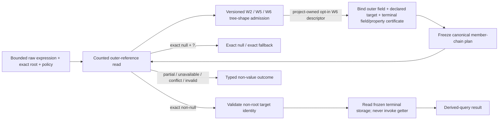

# Post-W5 Path Forward: W6 Bounded Member-Chain Query

> **Lifecycle:** Current · **Roadmap:** Active
>
> **Decision:** implement one fixed-depth, null-aware member-chain query slice selected by W5.5b, using one complete
> Roslyn C# expression parse followed by versioned project-owned tree-shape admission; no other successor is
> pre-approved.
>
> **Evidence boundary:** W6 is a prototype-design milestone grounded in predeclared synthetic incidents. It does not
> establish field readiness, and W5's hosted-gate exception does not carry forward.

## 1) Executive decision

W5 closed the expression-to-result product path and then measured twelve independently dumped incident questions
across request-pipeline and batch-pipeline shapes. Four questions stopped first at member navigation, compared with
three at context acquisition and one at method execution. The deterministic W5.5b ranking therefore selected
`AdmitFixedDepthMemberChain`.

The next stage is **W6 — bounded member-chain query**:

```csharp
root.Failure.Code
root.Failure?.Code ?? "<none>"
root.CurrentRequest.Status
root.LastFailure?.Code ?? "<none>"
root.Progress.State
root.Progress.CompletedPartitions
```

W6 adds one reference hop and one certified terminal data-member read to the derived-query path. It also replaces
incremental handwritten expression parsing with the [C# Expression Front-End and Subset-Admission Contract](../proposals/architecture/csharp-expression-front-end-contract-proposal.md).
Roslyn parses the complete bounded C# expression; product-owned recognizers still admit only W2, W5, or the selected
W6 tree shapes. This does not add general expression binding, arbitrary graph walking, a new interpreter opcode,
another method shape, or a debugger subsystem. Existing W2 one-field and W5 method behavior keeps its default routing,
canonical codecs, and semantics byte-for-byte stable on a fixed artifact baseline; target-bound identities follow
section 5.1.

This is deliberately more than a syntax-front-end increment. A truthful member chain requires:

1. one pinned complete expression parse, a closed admitted tree shape, and a canonical chain identity;
2. declared-type binding of the terminal data member even when the intermediate reference is exactly null;
3. a counted raw-memory observation of the intermediate reference;
4. a non-root identity for the referenced object, without inventing root provenance;
5. an immutable plan that freezes both member selections before evaluation and never rebinds them;
6. exact, null, partial, unavailable, conflict, invalid, and direct-null outcomes that remain distinct; and
7. same-session, fresh-session, and dump-close/reopen canonical replay through the headless product consumer.

W6 is estimated at `~10K LOC` and is split into `~1K LOC` vertical checkpoints. This detailed contract and navigation
reset is itself `~1K documentation LOC`; a later small closure reconciliation remains `~100 documentation LOC` scale.
These are order-of-magnitude implementation scales, not schedule forecasts.

## 2) Evidence basis and success question

### 2.1 What W5 established

The W5.5b designed portfolio recorded:

| Evidence fact | Raw count |
|---|---:|
| Independent dumps / incident questions | 12 / 12 |
| Structural application shapes | 2 |
| Admitted questions | 8 / 12 |
| Exact answers | 4 / 12 |
| Useful answers among partial-or-unknown outcomes | 2 / 3 |
| Decision-changing answers | 6 / 12 |
| Member-navigation blockers | 4 |
| Context-acquisition blockers | 3 |
| Execution-body blockers | 1 |
| Representative or external observations | 0 |

The four member-navigation questions were:

- `root.Failure.Code`;
- `root.CurrentRequest.Status`;
- `root.LastFailure.Code`; and
- `root.Progress.State`.

Each had an exact selected root, and the predeclared portfolio classified the required terminal-member evidence as
exact. W5 stopped at syntax and did not bind those terminal members, so that classification is a scenario assertion,
not validation evidence. W6 must prove or refute it through an emitted-shape gate before implementing value reads.

That gate matters because the current terminal names are positional-record auto-properties: `Code`, `Status`,
`State`, and `CompletedPartitions` are not FieldDef names. Their storage is compiler-generated. Rewriting those
fixtures into easier direct fields after they selected the roadmap would change the question to fit the implementation.
W6 instead admits one narrowly certified field-backed data-property shape, reads its correlated storage directly, and
still excludes arbitrary property behavior. This keeps the literal W5 questions intact.

The missing capability is therefore the product path from one exact outer reference through either a direct terminal
field or a certified terminal data property. This remains a better next experiment than adding unrelated IL, context
discovery, or presentation behavior.

### 2.2 The W6 product question

W6 asks:

> Can one exact dump root, one ordinary object-reference field, and one terminal direct field or certified field-backed
> data-property storage be bound and evaluated as a deterministic derived query, including honest null and degraded-
> evidence behavior, without caller-assembled runtime structure or repeated member lookup?

The milestone succeeds only if an external headless consumer can answer that question against real generated dumps
and a predeclared multi-shape synthetic portfolio can use the resulting answers to choose the following prototype
direction.

### 2.3 What the evidence does not establish

The W5 corpus is designed evidence over source-controlled fixtures. It does not establish how often a member chain is
available or useful in external incidents. W6 may advance prototype design on the strength of the selected synthetic
decision, but it must continue to report a representative/external-observation denominator of zero unless separately
qualified observations are supplied later.

## 3) Scope lock

### 3.1 Opt-in language profile and admitted tree shape

W6 adds exactly one opt-in language profile, `FixedDepthMemberChainV1`. Existing APIs and manifest schema versions
continue to default to the frozen W5 language profile. In particular, the four historical W5.5b rows remain
`Unsupported`; their schema, classification, aggregate-count semantics, and checked-in historical artifacts remain
unchanged; and `w5-usefulness-meaningful-synthetic-v2.json` is never rewritten to look retrospectively admitted. Full
reports regenerated from the intentionally changed W6.1 target artifact receive new content-derived identities; they
are not falsely required to equal reports generated from the earlier PE and dumps byte for byte.

Every bounded request is parsed once by the pinned `RoslynCSharpExpressionV1` profile. Only when the caller or
versioned W6 manifest explicitly selects `FixedDepthMemberChainV1` does the ordered admission table enable the W6
recognizer after the W2 and W5 recognizers. The notation below describes the project-owned admitted tree shape; it is
not a lexer or parser grammar:

```text
chain        := root-name "." reference-member hop terminal-member coalesce?
hop          := "." | "?."
coalesce     := "??" literal
literal      := null | Int32-literal | string-literal
```

Additional rules:

- There are exactly two member identifiers after the root: one intermediate reference and one terminal data member.
- The root-to-reference operator is always ordinary `.` because W6 still requires one exact non-null host-selected
  root.
- The second operator is ordinary `.` or null-conditional `?.`.
- `??` is optional and projects only the declared null, `Int32`, or string literal values.
- Roslyn owns lexical validity and full-expression parsing. The project applies the frozen expression, tree, depth,
  identifier-value, and decoded-string bounds before admission.
- New-profile identifier comparison uses ordinal `ValueText`; literal projection uses compiler token values. The
  complete spelling and value rules are frozen by the front-end contract.
- Classification is syntax-only. It performs no field catalog traversal and no dump-memory read.
- Recognizer precedence inside the opt-in profile is W2 first, W5 second, and W6 third over the same valid tree. The
  frozen W5 profile never enables the third recognizer. No admission path depends on another path's diagnostic.

The milestone examples are normative scenario inputs, not a promise that arbitrary members with the same spelling
shape will bind.

### 3.2 Admitted object and data-member shape

A W6 plan may bind only when all of the following are exact:

- the existing host-selected root binding;
- one directly declared ordinary instance field on the root's exact runtime type;
- that field's ordinary managed object-reference classification and declared reference type;
- one directly declared terminal data member on that declared reference type; and
- a terminal storage decoder already implemented by W2: `Int32`, `Nullable<Int32>`, or `String`.

The terminal data member is either:

1. a directly declared ordinary instance FieldDef; or
2. a directly declared, non-indexed instance PropertyDef whose getter is certified as a trivial field projection.

A property certificate requires all of the following from counted dump metadata and physical method-body evidence:

- one exact ordinal PropertyDef and associated non-static, non-generic, zero-parameter getter MethodDef on the exact
  declared TypeDef;
- one exact `MethodSemantics.Getter` association naming the selected getter and no second getter association; any
  setter association is retained as non-participating metadata, excluded from the projection proof, and never executed;
- exact property/getter/return signatures agreeing with one existing W2 terminal decoder;
- one unique same-TypeDef instance backing FieldDef with the same value type;
- an exact admitted getter body equivalent to `ldarg.0; ldfld <that FieldDef>; ret`, with the header kind and
  `maxstack` profile frozen by W6.1, no init-locals flag, nil local signature, no prefixes, EH, extra sections,
  branches, calls, trailing instructions, or unconsumed body bytes;
- exact runtime storage whose FieldDef token agrees with the certified backing field; and
- one immutable certificate retaining PropertyDef, getter, body, backing FieldDef, type, and storage identities.

The getter is never invoked. The property certificate proves that reading the backing storage is the exact data
projection requested by the member name. A name pattern such as `<Name>k__BackingField` is neither necessary nor
sufficient by itself.

The intermediate declared type and an exact non-null runtime target must match ordinally by snapshot, module, type
name, and non-nil TypeDef identity. An internally consistent runtime object whose exact type differs is an exact-
evidence unsupported shape, while contradictory facts about the same runtime object are a conflict. W6 does not
perform base-type, interface, variance, proxy, assignability, or derived-type member binding. A later evidence-selected
slice may revisit that rule.

The terminal member and, for a certified data property, its backing storage are selected from the intermediate field's
declared type during preparation, not from the eventual runtime object during evaluation. This is essential for three
reasons:

1. an exactly null `?.` receiver must still reject a nonexistent or incompatible terminal member; and
2. evaluation must never repeat field/property catalog lookup or silently select a different member on a runtime
   subtype; and
3. the W5-selected record properties must be admitted from physical evidence rather than inferred from spelling.

### 3.3 Admitted values and transformations

W6 reuses `DumpQueryValue` without adding a value kind:

- exact or partial `String`;
- exact `Int32`; and
- exact `Null`, including a null-conditional short circuit or a null terminal `String`/`Nullable<Int32>`.

Literal coalescing remains a deterministic derived-query transformation. It applies only to an exact null. It never
turns a partial, unavailable, conflicting, invalid, or direct-null-receiver outcome into a concrete fallback.

Null-conditional access deliberately lifts a non-nullable `Int32` terminal to `Int32-or-null`, so
`root.ActiveJob?.RetryCount ?? 0` is admitted even though unchanged W2 correctly rejects `??` on a direct non-nullable
`Int32`. Effective compatibility is:

| Terminal storage | Direct `.` result | Conditional `?.` result | Compatible fallback |
|---|---|---|---|
| `Int32` | non-null `Int32` | `Int32` or null | none for direct; `Int32` or null for conditional |
| `Nullable<Int32>` | `Int32` or null | `Int32` or null | `Int32` or null |
| `String` | string or null | string or null | string or null |

### 3.4 Explicit exclusions

W6 does not admit:

- three or more member identifiers after the root;
- a null-conditional root, repeated null-conditional hops, or a conditional operator;
- computed, indexed, static, inherited, virtual, interface-dispatched, or otherwise uncertified properties/getters;
- arbitrary methods, constructors, extension methods, or overload resolution;
- indexers, arrays, dictionaries, collections, enumeration, or LINQ;
- static, thread-static, frame, local, argument, or register context;
- inherited or interface member lookup, derived runtime targets, casts, conversions, or generics;
- arithmetic, comparisons, Boolean operators, assignments, statements, or user-defined operators;
- new IL opcodes, branches, handler transfer, allocation, virtual dispatch, or new pure models;
- implicit artifact lookup, source/PDB lookup, or caller-supplied metadata handles;
- a stable shipping command-line or public compatibility promise; or
- any representative-usefulness or field-readiness claim.

Roslyn-valid syntax outside the enabled admitted tree shapes is `Unsupported`, not malformed merely because W6 does
not implement it. Parser errors, recovery artifacts, and violated input invariants are `Invalid`. Captured evidence
that violates a supported evidence invariant remains `Invalid`; available evidence that disagrees remains `Conflict`.

## 4) Normative staging and ownership

### 4.1 Four-stage query contract

W6 makes parsing, admission, evidence binding, and value reads separate:

| Stage | May do | Must not do | Success artifact |
|---|---|---|---|
| Parse | Apply the pre-parse bound and parse one complete C# expression with the pinned Roslyn profile; reject diagnostics/recovery and apply structural bounds | Select a product operation, traverse metadata, inspect a runtime type, or read dump memory | Internal valid bounded Roslyn tree |
| Admit/classify | Run enabled tree-shape recognizers in declared order and project one project-owned descriptor | Reparse, expose Roslyn objects, traverse metadata, or read dump memory | Canonical W6 chain request plus internal admitted descriptor |
| Prepare | Validate the exact root; bind the outer field, declared intermediate type, terminal field or certified data property, and physical terminal storage once; freeze all descriptors and bounds | Read the reference value, inspect the referenced runtime object, execute a getter, or decode the terminal value | Immutable complete member-chain plan |
| Evaluate | Read the frozen outer reference, short-circuit or validate the referenced target, compute the frozen terminal storage location, decode it, and apply exact-null coalescing | Repeat root selection, field/property lookup, property certification, declared-type lookup, or parsing | Derived-query result |

Every failure exposes only the evidence accumulated through its stopping boundary. No partial plan escapes
preparation.

### 4.2 End-to-end data flow



### 4.3 Physical ownership

W6 adds no project. Responsibilities remain aligned with the current fourteen-project solution:

| Project / area | W6 responsibility |
|---|---|
| `Interpreter.Product.DumpQuery` | Sole internal Roslyn dependency, pinned expression adapter, W2/W5/W6 tree recognizers, immutable project-owned parsed shapes, declared-member plan, derived-query evaluator, null/coalesce semantics, canonical plan replay; no Roslyn type escapes |
| `Interpreter.Host.Dump.ClrMD` | Immutable declared-type/field/property certificate projection from SRM plus dump evidence, counted object-reference observation, exact non-root target identity, descriptor-consuming terminal reads |
| `Interpreter.Product.DumpDebugging` | Explicit opt-in language profile, append-only expression-kind routing, W6 request identity, product outcome projection, preservation of W2/W4 payloads |
| `Interpreter.Headless.ReferenceConsumer` | Versioned W6 manifest/report execution and usefulness reporting; frozen W5 manifests/reports remain unchanged; no reusable query semantics |
| `Interpreter.TestTarget` | Source-controlled multi-shape object graphs and readiness oracles |
| Unit/integration corpus | Three-bucket parser/admission laws, legacy compatibility, adapter evidence, plan/evaluation semantics, real dumps, fresh-process replay, and usefulness decision |

Illustrative type names in this plan express ownership, not a frozen public API. Any public prototype type or method
introduced during implementation requires complete XML documentation and an explicit draft-phase caveat.

## 5) Identity, evidence, and replay contract

### 5.1 Existing identities remain frozen

For the frozen W2/W5 compatibility corpus, W6 freezes the existing canonical encodings, schemas, language-profile
defaults, classification, diagnostics, outcome semantics, and aggregate-count rules. The existing nine-row generated
corpus and twelve-row W5.5b corpus remain replayable without schema rewriting, and their checked-in historical
artifacts remain commit-scoped evidence rather than being rewritten. Roslyn replaces the implementation mechanism in
W6.2; it does not rewrite the historical claim that the earlier artifacts used the handwritten parser.

W6.1 intentionally adds coordinator and workflow graphs to `Interpreter.TestTarget`, so its PE identity and every dump-
or PE-derived W2/W4/W5 identity necessarily change for newly generated artifacts. After the emitted-shape relations
pass, current artifact-derived goldens are refreshed exactly once and attributed to the new PE; comparison across that
boundary is semantic and relational, not byte identity across different content. Within either fixed content baseline,
same/fresh/reopen replay must remain byte-identical.

W6 uses an explicit opt-in language-profile identity, an append-only expression kind, and a separately tagged chain
identity. The W6 encoding also names `RoslynCSharpExpressionV1`; its descriptor freezes the package, C# language
version, parse options, full-text rule, and front-end limits. Existing overloads/default manifests remain on the
frozen W5 profile. A new encoding may add a front-end, profile, or chain payload only for the opt-in request; it must
not append even a false/default marker to old canonical byte sequences. Golden legacy tests prove this before W6
evaluation code lands.

### 5.2 Chain request identity

The canonical W6 chain request includes:

- its own schema and grammar identity;
- the `RoslynCSharpExpressionV1` front-end identity;
- the explicit `FixedDepthMemberChainV1` profile identity;
- the exact raw expression, including whitespace;
- root name and the complete existing exact root binding;
- ordered intermediate/terminal identifiers;
- direct versus null-conditional hop;
- the complete optional literal kind and payload;
- every actually reached front-end/admission bound; and
- the unchanged product policy identity supplied with the request.

Syntactically bounded unsupported/invalid inputs retain a canonical raw request where the existing W5 issuance rules
permit one. Oversized input and non-exact roots continue to have no issued canonical request.

### 5.3 Declared member-chain plan identity

A successful plan freezes:

- the chain request identity;
- root snapshot/module/type/object and root-selection evidence;
- the complete outer field descriptor and absolute storage address;
- the intermediate declared module and TypeDef identity;
- the public terminal member identity: either one FieldDef or one PropertyDef/getter/body certificate;
- the complete terminal storage FieldDef/type descriptor relative to the declared intermediate type;
- for a certified property, the correlated getter body and backing-field identity proving the data projection;
- the terminal decoder kind;
- direct/null-conditional and coalesce semantics;
- every applied root, front-end, field-catalog, type, and read-size bound that preparation actually reached; and
- an explicit declaration that the runtime reference value and terminal value have not yet been read.

The terminal descriptor must carry enough relative-layout information for evaluation to derive its absolute address
after validating an exact non-null target. Evaluation must not call `GetInstanceField`, enumerate a field catalog, or
resolve a metadata token.

### 5.4 Non-root object identity

The current root object projection carries a handle slot and handle kind. A referenced object has neither. W6 must not
populate those properties with the parent field address or another invented value.

Introduce two distinct immutable projections, or factor equivalent internal shapes while preserving every existing
public and canonical root property:

1. `ReferencedObjectIdentity` is intrinsic to the observed target within the snapshot: snapshot and memory-source
   identity, target address, exact runtime type name, TypeDef, method table, module identity, and validated object
   size/extent.
2. `ObjectReferenceObservationIdentity` is path-specific selection provenance: parent object identity, frozen outer
   FieldDef/storage identity, counted reference-pointer read, and counted object-header/type-validation evidence
   actually used.

Aliases that point to the same target have equal `ReferencedObjectIdentity` values but distinct
`ObjectReferenceObservationIdentity` values. Canonical W6 results retain both; neither invents a handle slot, handle
kind, or root-selection claim.

### 5.5 Replay obligations

For every successful or typed terminal corpus row:

- repeated evaluation of the same immutable plan in one session performs no member lookup and reproduces canonical
  result bytes;
- a fresh product object over the same open session reproduces request, plan, reference observation, and result;
- complete dump close/reopen, root rediscovery, and plan reconstruction reproduce all canonical artifacts; and
- a plan or descriptor from a different snapshot fails with typed conflict before decoding a value.

Target addresses remain valid replay material only within the content-identified immutable snapshot. They are never
global object identities.

## 6) Result semantics

### 6.1 Semantic mode and effects

Every accepted `FixedDepthMemberChainV1` request that reaches binding or evaluation returns
`EvaluationResult<DumpQueryValue>` in `DerivedQuery` mode with `None` effects, including no-plan preparation failures.
Only failures before query admission or exact root-bound request issuance lack a semantic mode. No W6 result claims
user IL execution, historical execution, abstract analysis, or a target write.

The product facade reuses the W2 truth envelope and value union. The broad append-only enum case
`DumpExpressionKind.MemberChain` identifies routing, while the stable `FixedDepthMemberChainV1` profile identity names
this exact admitted tree shape and contract; they are deliberately different axes. The request retains both so chain admission is
not confused with the unchanged W2 single-field path.

### 6.2 Required outcome matrix

| Intermediate reference evidence | Hop | Terminal evidence | Coalesce | Required outcome |
|---|---|---|---|---|
| Exact non-null, exact matching target | `.` or `?.` | Exact non-null value | absent | Completed, complete, exact value |
| Exact non-null, exact matching target | `.` or `?.` | Exact null | absent | Completed, complete, exact `Null` |
| Exact non-null, exact matching target | `.` or `?.` | Exact null | compatible literal | Completed, complete, exact literal plus coalesce provenance |
| Exact null | `?.` | Declared leaf was prepared; value read not reached | absent | Completed, complete, exact `Null`; no target or leaf read |
| Exact null | `?.` | Declared leaf was prepared; value read not reached | compatible literal | Completed, complete, exact literal; no target or leaf read |
| Exact null | `.` | Value read cannot continue | any | `DerivedQuery`; blocked, no value, exact evidence, stable `QUERY_CHAIN_NULL_RECEIVER`; coalesce does not run |
| Partial pointer | either | Not reached | any | Blocked, no value, partial evidence; coalesce does not run |
| Unavailable pointer | either | Not reached | any | Blocked, no value, unavailable evidence; coalesce does not run |
| Exact pointer, internally consistent runtime object whose exact type differs from the frozen declared type | either | Not reached | any | `DerivedQuery`; blocked, completeness `None`, exact evidence, no value, stable `QUERY_CHAIN_RUNTIME_TYPE_UNSUPPORTED`; leaf address is not derived |
| Exact pointer, object-header/runtime/module/TypeDef facts disagree for the same target | either | Not reached | any | Conflict, no value; leaf address is not derived |
| Exact pointer, partial target header/type/extent validation | either | Not reached | any | Blocked, no value, partial evidence; leaf address is not derived |
| Exact pointer, unavailable target header/type/extent validation | either | Not reached | any | Blocked, no value, unavailable evidence; leaf address is not derived |
| Exact pointer, invalid target structure | either | Not reached | any | Invalid, no value; leaf address is not derived |
| Exact matching target | either | Cap-truncated, otherwise readable string prefix with `LimitExceeded` | any | Completed, partial prefix, partial evidence; coalesce does not run |
| Exact matching target | either | Sparse/missing-memory string prefix | any | Blocked, partial prefix, partial evidence; coalesce does not run |
| Exact matching target | either | Unavailable leaf | any | Blocked, no value, unavailable evidence; coalesce does not run |
| Exact matching target | either | Conflicting/invalid leaf | any | Typed conflict/invalid result with no value |

The direct-null row remains an admitted `EvaluationResult<DumpQueryValue>` rather than a classification or facade
failure. Its separate completion/evidence axes say that evaluation could not continue even though the receiver state
was exact. The stable diagnostic, request/plan identity, pointer read, null hop index, context, and provenance preserve
the distinction from missing evidence, exact null produced by `?.`, and invalid input.

Null-conditional short-circuit and coalesce selection are structured transformation provenance, not merely scalar
outcomes. Results retain the selected or unselected fallback, hop index, and reason no target or leaf read was reached,
following the existing W2 coalescing contract.

### 6.3 Preparation failures

Preparation returns no plan when:

- the outer member is missing, ambiguous, inherited, static, or not an ordinary object reference;
- the declared target type is unavailable, conflicting, invalid, generic, or outside the exact-type rule;
- the terminal member is missing, ambiguous, inherited, static, or outside the three existing decoder kinds;
- a PropertyDef is indexed, behavior-bearing, lacks exact getter/body/backing storage evidence, or fails any certificate
  correlation rule;
- the coalescing literal is incompatible with the terminal result type;
- a catalog/type/layout bound is exhausted; or
- any frozen identity or relative storage range is inconsistent.

Once syntax is admitted as `DumpExpressionKind.MemberChain` and acquisition has issued the exact root-bound request,
these are typed `DerivedQuery` preparation results with no plan. They use the existing independent completion,
completeness, evidence, effect, context, provenance, and diagnostic axes; they never receive
`CounterfactualExecution`. Failures before query admission or root-bound request issuance remain classification or
acquisition outcomes and receive no fabricated semantic mode.

### 6.4 Read and traversal accounting

W6 reports only bounds actually reached:

- existing expression, root-selection, decoded-literal, `receiver.identifier`, and `terminal.identifier` bounds;
- one `receiver.field_catalog` traversal on the exact root type;
- separate `terminal.field_catalog` and `terminal.property_catalog` traversals on the declared target type;
- bounded `terminal.method_semantics`, getter-MethodDef lookup, getter-body bytes/sections/instructions, and complete-
  body consumption when the terminal name resolves as a property;
- one fixed reference-hop/depth bound and one `receiver.reference` pointer-width raw read;
- bounded `receiver.object_header`, runtime-type, module/TypeDef, and object-extent validation;
- checked `terminal.relative_layout` and nullable-child range derivation within the validated target extent;
- one `terminal.value` scalar/nullable/string read using the existing W2 read-size and string-character bounds; and
- canonical request/plan/result/report byte limits.

An exact null-conditional short circuit reports the pointer read but no target-validation or terminal-value read. A
syntax or preparation failure reports no value-read bound. A partial pointer read reports its requested and observed
width and stops.

Every bound name is stage-qualified and unique because the common evidence context rejects duplicates. Requested and
observed byte or catalog counts remain accounting and provenance fields; they never substitute for an admission bound.

## 7) Delivery sequence

### W6.0 — contract and roadmap freeze

**Scale:** `~1K LOC` documentation.

Publish this plan and the C# expression-front-end contract, link them from active navigation, add the planned
traceability requirement, and freeze the admitted shapes, semantics, exclusions, and closure rule before
implementation.

**Exit gate**

- W5 remains closed and historical evidence is not rewritten.
- All current status surfaces name W6, not W5, as active delivery.
- The selected examples, certified-property dependency, outcome matrix, checkpoint sequence, and post-W6 decision
  gate agree.
- Markdown links and headless-workflow guards pass, and a manual project-authored caveat-vocabulary scan records its
  exclusions rather than pretending an automated repository guard exists.

### W6.1 — emitted-shape and fixture truth gate

**Scale:** `~1K LOC`.

Freeze the actual emitted forms selected by W5 before admitting new syntax. Prove the current positional-record
PropertyDefs/getters/backing FieldDefs/getter bodies from physical target evidence. Add the coordinator and workflow/
dispatch graphs needed by the W6.6 portfolio now, then intentionally refresh the current TestTarget PE and every
derived W4/W5 graph identity once. Preserve older hashes as commit-scoped evidence and accept new goldens only after
relational metadata/body facts pass.

This checkpoint uses an independent compiler/SRM fixture oracle to freeze the admitted emitted profile. It does not
implement or share the reusable certificate recognizer under test; that product projection belongs to W6.3.

**Required evidence**

- exact PropertyDef/getter/backing FieldDef/signature/body facts for `Code`, `Status`, `State`, and
  `CompletedPartitions`;
- exact proof that each admitted getter is the one frozen trivial load/return profile and no broader getter shape;
- negative computed, indexed, static, inherited, mismatched-field, extra-instruction, call, branch, local, and EH
  property profiles;
- complete relational target-fixture facts before any PE/hash refresh;
- one explicit current PE/derived-identity refresh with historical hashes left untouched; and
- no Roslyn package integration, product tree admission, or terminal value read yet.

**Implemented checkpoint.** Commit `0dc055e66` closes W6.1 at `~1K LOC`. The independent fixture oracle proves ten
selected terminal properties and ten deliberately distinct negative profiles, freezes the four non-inheriting graph
families and all twenty-four target invocations, and starts both new targets through the hidden-process harness. The
single intentional current artifact transition is frozen as follows; the preceding values remain historical evidence
at their original commits rather than claims about the rebuilt artifact.

| Identity | Previous fixed-content baseline | Current W6.1 baseline |
|---|---|---|
| Complete TestTarget SHA-256 | `abd919f1eb2ca1b0329e05fe2f3ee580672698560d64991d17aa8d9d3ba3384e` | `35922edc1898aaaf3942a4edcb3d2045eac67d7e69b08fd2f56a68e2be30f153` |
| W4 interpreted mixed graph | `610dfb334f02cc2afb9b3582b391e8122eecd130236006f44a7bd9389281ec3d` | `99f99db8a130095b9d14e453371304078663ea28948ca26f02c47337e897b6d6` |
| W4 interpreted dual-unknown graph | `09a0e3f37610a7b266aa61e9c3da901920e1fad3adf3118013ac4f99ffb90f1b` | `d63d6e626ddb3df72a4eee6654cf368f71992ba00768ea58b8e1f620f734b35d` |
| W4 modeled mixed graph | `c9f9980c1b77914283aacd7f8125f576f564900ba6fb4cc0c57476a5c4426cc3` | `1733ca2d6acf1fd6d3cffc5c744e034a0d5ef73543e36d2941779e0d353b85bd` |
| W4 modeled dual-unknown graph | `501c87c9fb351916dde583734af512798b7b30859dc3beac2cc22353d77fce4d` | `592a19f686c2719309b3222a5806892382fccd8748aad2c630ffc058bf35d477` |

The current complete artifact is 28,160 bytes. Its MVID is `826aa3bd-c8a6-4397-9641-df7782f285ec`; its 16,768-byte
metadata root has SHA-256 `27089eb8b8559ab02f1b4ecec73b6f72d21d7f9131821e453aadaa121117a55b`.

### W6.2 — Roslyn expression front end, versioned tree admission, request identity, and routing

**Scale:** `~1K LOC`.

Pin `Microsoft.CodeAnalysis.CSharp/5.3.0`; add `RoslynCSharpExpressionV1`; route one full-text C# expression parse
through ordered W2, W5, and opt-in `FixedDepthMemberChainV1` recognizers; project only immutable project-owned nodes;
and remove the handwritten reader and diagnostic-dependent W5 string route after differential compatibility passes.
Keep exact W5 method spelling and the existing W2 lexical subset in the frozen default profile. Preserve W5 manifests,
schemas, classifications, outcome semantics, aggregate-count rules, and legacy canonical bytes.

**Required evidence**

- the exact package, C# 14 regular-source options, full-text consumption, expression/tree/depth/value bounds, and
  stable parser-error normalization;
- direct and null-conditional forms, optional literals, decoded identifiers/values, trivia, casing, and profile
  spelling policy;
- valid-but-unsupported one-member duplication, three-hop chains, repeated `?.`, calls, indexers, and suffixes;
- complex patterns, lambdas/LINQ, interpolation, casts/indexers, switch expressions, and malformed near-neighbors in
  an explicit valid-admitted / valid-unsupported / invalid corpus;
- syntax accepts a member name without pretending to know whether metadata later binds it as a field or property;
- exact unsupported-versus-invalid diagnostic classification;
- zero calls to metadata, field, memory, method, or execution capabilities during classification;
- one parse per classification, no parse during preparation, no Roslyn type outside the front-end boundary, and no
  compilation or semantic model;
- compatibility goldens proving unchanged legacy encodings and behavior over a fixed artifact baseline, plus the one
  explicit W6.1 refresh for PE/dump-derived identities; the four historical W5.5b rows remain unsupported under the
  default profile; and
- same/fresh-object canonical opt-in chain-request replay and deletion of the production handwritten parser.

**Implemented checkpoint.** Commit `68aaf418f` closes W6.2 at `~1K LOC` scale. It pins the sole direct Roslyn package
on `Interpreter.Product.DumpQuery`, uses one C# 14 regular-source full-text expression parse, projects disjoint W2,
W5, direct-chain, and conditional-chain shapes into project-owned descriptors, and adds a separately tagged opt-in
request/chain identity. The production handwritten reader, literal decoder, and W5 diagnostic-dependent fallback are
absent. The W5 evaluator consumes the already parsed direct-member descriptor, so preparation does not parse again.

The source-controlled three-bucket corpus includes rich valid trees and malformed neighbors; package/profile, bounds,
one-parse-site, public-surface, and dependency-placement guards are executable. Locked restore, strict Release 0/0,
unit 502/502, Fast 119/119, and the focused 52/52 parser/W2 replay/W5 dump/headless/W6 lane pass with zero skips. That
focused lane runs the twelve-incident synthetic portfolio and preserves all four historical member-chain rows as
unsupported under the default profile while the explicit W6 profile admits their syntax without claiming binding or
evaluation.

### W6.3 — declared reference target and terminal data-member certificate

**Scale:** `~1K LOC`.

Extend the ClrMD/SRM boundary with immutable projections for an outer reference field's declared target type and one
terminal direct field or certified field-backed property. Freeze TypeDef, FieldDef, PropertyDef/getter/body, decoder,
and relative storage identities without reading the outer reference value or executing the getter.

**Required evidence**

- exact request/batch fixture target types and their certified `Code`, `Status`, `State`, and `CompletedPartitions`
  data properties, plus direct terminal-field conformance rows;
- exact counted dump metadata and physical getter-body evidence; an independently identified disk PE may be a late
  equality oracle but never the source of the certificate;
- PropertyDef/getter/backing FieldDef/signature/body correlation and direct-declaration enforcement;
- ordinal field/property duplicate detection;
- terminal decoder classification for `String`, `Int32`, and `Nullable<Int32>` only;
- missing, inherited, indexed, static, computed, unsupported type/body, partial catalog/body, unavailable, conflict,
  invalid, and limit outcomes;
- counting/poisonable capability tests proving no reference or leaf value read; and
- canonical projection equality, defensive immutability, foreign-snapshot rejection, and complete XML documentation.

### W6.4 — reference observation, non-root identity, and immutable plan

**Scale:** `~1K LOC`.

Add a counted object-reference field observation, validate exact non-null targets without giving them fabricated root
facts, and freeze the complete member-chain plan. Retain validated target size/extent and relative terminal/nullable
child layouts so evaluation can checked-add and range-check every address. Factor only the minimal common internal
object identity needed by root and referenced-object descriptor-consuming reads; preserve all existing public and
canonical root shapes.

**Required evidence**

- exact non-null and exact null pointer decoding at both supported pointer widths where the adapter contract permits;
- partial/unavailable pointer reads with retained prefixes and no pointer fabrication;
- conflicting owner/snapshot/object facts, exact-evidence unsupported runtime-type mismatch, invalid
  pointer/object/header/layout, and overflow-safe address derivation;
- an internally consistent target with a different exact runtime type reported as unsupported rather than conflict,
  without adding base-chain or assignability traversal;
- distinct selection provenance for aliasing fields that point to one object;
- complete plan identity with no partial plan on failure;
- poison tests proving preparation performs no pointer or terminal-value read; and
- poison tests proving evaluation never repeats member/type catalog lookup.

### W6.5 — derived-query evaluation, product facade, and headless conformance

**Scale:** `~1K LOC`.

Evaluate the frozen plan through the strict matrix in section 6. Reuse the W2 terminal decoders and value union through
descriptor-consuming storage overloads; never invoke a certified getter, duplicate decoding logic, or re-enter W2
parsing/preparation. Route the opt-in result through the existing facade and a versioned W6 consumer manifest/report.

**Required evidence**

- exact direct and conditional string/int/nullable results;
- exact intermediate null with and without coalescing, and zero target/leaf reads after the short circuit;
- a direct-null receiver result that is blocked with no value, exact pointer evidence, and its stable diagnostic;
- partial/unavailable references, target validation, and leaves; both partial-string completion forms; conflict,
  invalid, and incompatible coalescing;
- coalescing only after exact null, never after uncertainty;
- complete independent result axes, ordered provenance, and exact reached-bound sets;
- repeated/same-session/fresh-session canonical replay; and
- exact output for the four W5-selected questions while the historical W5 profile/report still shows them unsupported;
- the exact selected answers are `request-failed`, `running`, `batch-failed`, and `running` for the frozen W5 target
  arguments, with property/getter/storage provenance retained rather than inferred;
- one expression, one typed root-selection outcome, and policy enter the consumer; admitted member-chain evaluation
  requires an exact root, while non-exact roots become deterministic classification/context rows; no caller supplies
  field descriptors, target addresses, plans, or adapter internals;
- the consumer serializes exhaustive absence, partial, unavailable, ambiguous/conflicting, and invalid root-selection
  outcomes instead of exiting before the scenario row is written;
- fresh hidden target and consumer processes for every row;
- exact human/machine reports that omit target-derived values from diagnostics and shape-only logs;
- repeated evaluation, fresh process, and dump close/reopen/rebind produce byte-identical artifacts;
- unsupported W6 syntax and all typed failures remain present in the report rather than being dropped; and
- every managed launch uses `eng/Invoke-HeadlessProcess.ps1` or equivalent hidden no-UI process creation.

### W6.6 — meaningful synthetic portfolio and next decision

**Scale:** `~1K LOC`.

Create a predeclared schema-v3 portfolio with twenty-four independent dumps and questions across four structurally
different application graphs. Extend the usefulness runner append-only with a W6 admission path and post-W6 blocker
vocabulary; do not rewrite W5 schema-v2 reports or counts.

The portfolio must be complex enough to exercise real object-graph distinctions, not twenty-four value substitutions on
one shape. The initial scenario design is in section 8.

**Required evidence**

- one full independent snapshot and one question per incident, with twenty-four distinct snapshot hashes;
- four distinct root types and materially different optional/non-optional/reference/leaf layouts;
- predeclared target arguments, root selector, expression, evidence view, expected outcome/value or prefix, usefulness,
  decision impact, and first stopping boundary;
- exact, null-short-circuit, fallback, partial, unavailable, conflict, invalid, direct-null, and unsupported rows;
- two fresh portfolio processes produce byte-identical machine and human reports;
- raw counts only, with generated, synthetic, and representative corpus kinds still non-promotable; and
- a unique post-W6 prototype action selected only if it clears the evidence threshold in section 10; otherwise the
  successor remains explicitly deferred rather than being chosen by enum order or architecture taste.

### W6.7 — repository closure

**Scale:** `~100 LOC` documentation.

Reconcile every authoritative document, run the complete headless matrix, record the coarse realized scale, and close
W6 only at the exact pushed commit that satisfies its required gates.

**Exit gate**

- locked restore and strict Release build pass for the complete solution with zero warnings/errors;
- complete unit, Fast, ordinary dump, optimized dump, focused W6, generated corpus, and meaningful synthetic lanes
  pass with zero skips;
- W2/W4/W5 canonical encodings, default classifications, schemas, outcomes, and gates remain unchanged; historical
  artifact-derived goldens stay preserved and current goldens carry the explicit W6.1 identity refresh;
- Markdown and headless-workflow guards pass;
- the exact pushed commit's required hosted jobs actually execute and pass; and
- the selected post-W6 action is documented but not silently implemented as W6 work.

W5's 2026-07-16 hosted-only exception applies only to W5. W6 remains open if its hosted jobs do not execute, unless
the owner gives a new explicit milestone-specific disposition.

## 8) Synthetic scenario design

### 8.1 Structural shapes

The W6.6 portfolio starts with four source-controlled graph families:

1. **Request pipeline** — optional `Failure`, required `CurrentRequest`, strings, correlation state, and retry data.
2. **Batch pipeline** — optional `LastFailure`, required `Progress`, string and integer leaves, and partition data.
3. **Coordinator pipeline** — optional owner/job references, a deeper shard/health branch, worker collection, and one
   zero-argument status method retained as an unsupported comparison case.
4. **Workflow/dispatch pipeline** — current-attempt and optional-error references, worker assignment, attempt
   collection, and a second zero-argument status method independent of the coordinator shape.

The added shapes must not inherit from either existing root or each other. They distinguish fixed-depth success from
deeper navigation, collection, context, and call blockers after W6 lands. They are frozen in W6.1 so later corpus work
does not cause unexplained target-artifact churn.

### 8.2 Predeclared twenty-four-row baseline

W6.1 freezes every target-affecting graph, member name, constructor input, and value needed by these semantic rows
before the single PE/identity refresh. W6.6 may refine only manifest/report metadata that does not rebuild
`Interpreter.TestTarget`. Before any W6.1 target build or portfolio dump is generated, one versioned scenario draft
must therefore freeze the exact target inputs and expressions. Before any W6.6 evaluation, the versioned manifest must
additionally freeze every root selector/outcome, evidence view, expected completion/completeness/evidence/value or
prefix/diagnostic, usefulness classification, decision-changing flag, first boundary, and application shape:

| # | Shape | Expression / condition | Expected W6 boundary |
|---:|---|---|---|
| 1 | Request | `root.CurrentRequest.Status`, exact non-null reference | Exact string |
| 2 | Request | `root.Failure?.Code`, exact non-null reference | Exact string |
| 3 | Request | `root.Failure?.Code ?? "<none>"`, exact null reference | Exact fallback, no target/leaf read |
| 4 | Request | `root.Failure.Code`, exact null reference | `DerivedQuery`, blocked/no value/exact evidence, `QUERY_CHAIN_NULL_RECEIVER` |
| 5 | Request | `root.Failure?.Code ?? "<none>"`, partial pointer | Partial/blocked; fallback not applied |
| 6 | Request | `root.CurrentRequest.Status`, string capped by the configured observation bound | Completed/partial prefix with `LimitExceeded` and complete provenance |
| 7 | Batch | `root.Progress.State`, exact non-null reference | Exact string |
| 8 | Batch | `root.Progress.CompletedPartitions`, exact non-null reference | Exact `Int32` |
| 9 | Batch | `root.LastFailure?.Code`, exact null reference | Exact null |
| 10 | Batch | `root.LastFailure?.Code ?? "<none>"`, exact non-null reference | Exact code; fallback not applied |
| 11 | Batch | `root.Progress.State`, unavailable pointer | Unavailable/blocked |
| 12 | Workflow | `root.CurrentAttempt.Status`, certified terminal data property | Exact string on the fourth graph shape |
| 13 | Coordinator | `root.Owner?.Name ?? "<unassigned>"`, exact non-null owner | Exact name; unselected fallback retained in provenance |
| 14 | Coordinator | `root.ActiveJob?.RetryCount ?? 0`, exact null job reference | Exact integer fallback `0`, no target/leaf read |
| 15 | Coordinator | `root.ActiveShard.Health.State` | Unsupported third member hop |
| 16 | Coordinator | `root.Workers[0].State` | Unsupported collection/indexer navigation |
| 17 | Coordinator | `root.CurrentTask.GetState()` | Unsupported method shape |
| 18 | Coordinator | exhaustive zero-match root selection under the declared selector | Classification/context failure, `W5_ROOT_SELECTION_NOT_EXACT`, no query request or plan |
| 19 | Workflow | `root.CurrentAttempt.Status`, unavailable attempt reference | `DerivedQuery`; blocked, completeness `None`, unavailable evidence; fallback/leaf read not reached |
| 20 | Workflow | `root.CurrentAttempt.GetDisplayStatus()` | Unsupported second independently motivated method shape |
| 21 | Request | `root.CurrentRequest.Status`, exact pointer with object-header/runtime TypeDef disagreement | Conflict before leaf-address derivation |
| 22 | Workflow | `root.CurrentAttempt.Worker.State` | Unsupported third member hop on the fourth graph |
| 23 | Workflow | `root.Attempts[0].Status` | Unsupported collection/indexer on the fourth graph |
| 24 | Batch | `root.Progress.CompletedPartitions`, exact pointer with invalid target extent/header | Invalid before leaf read |

Evidence views may mask a real captured read as partial/unavailable or introduce an explicitly conflicting/invalid
test projection, but they may not invent an exact value absent from the dump. Every altered view retains the original
snapshot identity and a stable reason code explaining the transformation.

### 8.3 Generated conformance cases

The generated W6.5 corpus additionally covers mechanical boundaries that should not distort the meaningful incident
denominator:

- maximum expression/identifier/literal lengths and one-over-limit inputs;
- maximum node/token and syntax-depth limits;
- whitespace/comments/casing variants, complete C# lexical spellings selected by the profile, and unsupported
  suffixes;
- complex valid-but-unsupported expression trees paired with malformed invalid neighbors;
- missing, duplicate, inherited, static, unsupported-type, and over-limit members;
- foreign snapshots and descriptors;
- partial/unavailable target validation, pointer/address overflow, and conflicting/invalid object-header/type facts
  through injected adapter seams;
- null terminal strings and nullable integers with compatible/incompatible literals;
- alias fields selecting one target with distinct provenance;
- same-plan repeated evaluation with counting capabilities; and
- legacy W2/W5 encoding, schema, routing, outcome, and count regression plus the explicitly reviewed W6.1 refresh of
  target-derived identities.

These rows validate the implementation. They contribute nothing to the synthetic or representative usefulness
denominators.

## 9) Verification matrix

All managed commands remain headless. Exact filters may be refined as tests land, but the required coverage layers are:

| Layer | Required proof |
|---|---|
| Parser/classifier unit | Pinned Roslyn profile, full-text/integrity checks, complex three-bucket corpus, bounds, recognizer precedence, diagnostics, parse-once/no-prepare-parse, zero capability use, legacy identity preservation |
| Adapter unit/integration | Declared-type projection, direct FieldDef or certified PropertyDef/getter/backing-field selection, pointer evidence, target validation, relative address derivation, typed misses |
| Query unit/integration | Complete/no-partial plan, no rebinding, null/coalesce matrix, decoder reuse, result axes, provenance, canonical replay |
| Product Fast | Strict union routing, old W2/W4 payload preservation, preparation/direct-null terminals, deterministic reports |
| Ordinary generated dump | Exact/non-exact reference and leaf evidence, real object graphs, fresh process, close/reopen/rebind |
| Optimized dump regression | Existing optimized-context evidence remains passing; W6 claims only rows explicitly admitted there |
| Meaningful synthetic | Twenty-four isolated dumps, four shapes, raw counts, a threshold-qualified unique decision or explicit deferral, zero representative rows |
| Repository/document policy | Markdown-link and headless-workflow guards, documented manual authored-scope caveat-vocabulary scan, clean strict build |

The expected command shape remains:

```powershell
.\eng\Invoke-HeadlessProcess.ps1 dotnet restore Interpreter.sln --locked-mode
.\eng\Invoke-HeadlessProcess.ps1 dotnet build Interpreter.sln --configuration Release --no-restore --verbosity minimal --maxcpucount:1 --disable-build-servers /p:UseSharedCompilation=false
.\eng\Invoke-HeadlessProcess.ps1 dotnet test tests/Interpreter.Tests/Interpreter.Tests.csproj --configuration Release --no-build --no-restore --verbosity minimal
.\eng\Invoke-HeadlessProcess.ps1 dotnet test tests/Interpreter.IntegrationTests/Interpreter.IntegrationTests.csproj --configuration Release --no-build --no-restore --filter "Category=Fast" --verbosity minimal
.\eng\Invoke-HeadlessProcess.ps1 dotnet test tests/Interpreter.IntegrationTests/Interpreter.IntegrationTests.csproj --configuration Release --no-build --no-restore --filter "Category=Dump&Corpus=W6MemberChainV1" --verbosity normal
.\eng\Invoke-HeadlessProcess.ps1 dotnet test tests/Interpreter.IntegrationTests/Interpreter.IntegrationTests.csproj --configuration Release --no-build --no-restore --filter "Category=Dump&Corpus=W6MeaningfulSyntheticV3" --verbosity normal
pwsh -NoLogo -NoProfile -NonInteractive -File .\eng\verify-markdown-links.ps1
pwsh -NoLogo -NoProfile -NonInteractive -File .\eng\verify-headless-workflows.ps1
```

Every behavioral filter uses the milestone test selection. A missing platform prerequisite is a failed/open gate, not
a skipped success.

## 10) Post-W6 decision gate

W6.6 ranks first blockers by independent incident count, decision-changing count, useful-answer count, then exact
attributable-evidence count. Enum order may sort equal report rows but may not select a successor. One branch is
selected only when it is the unique leader after all four substantive comparisons and has at least three independent
incidents across at least two application shapes, including at least two decision-changing questions. A tie or a
leader below that floor leaves the successor explicitly deferred.

| Dominant recurring boundary after W6 | Permitted next action |
|---|---|
| Root/context attribution | Admit one concrete context-acquisition scenario; do not add expression depth |
| Third member hop | Admit one depth-three scenario with a separately bounded plan; do not also add collections |
| Collection/indexer navigation | Admit one concrete indexed collection shape; do not also add arbitrary depth |
| Repeated zero-argument method body | Admit only that scenario's complete execution dependency closure |
| Terminal member shape | Admit at most one separately evidenced emitted data-member shape; do not generalize to getter execution |
| Terminal value type | Admit at most one concretely laid-out decoder with its own bounds and degraded-evidence matrix |
| Result explanation/consumption | Improve the headless result explanation before adding semantics |
| No recurring useful answer | Stop feature expansion and reconsider the product thesis |

The synthetic decision advances prototype design only. Later external observations may confirm, reverse, or stop it.
Explicit deferral is a valid W6 result; a report must never manufacture a winner merely to name W7. No W7
implementation is pre-approved by this document.

## 11) Completion definition

W6 closes only when all of the following are proven at current state:

- Roslyn is the sole production expression parser and the exact W6 tree shapes in section 3 are the only new syntax
  admitted for binding/evaluation;
- the package/options profile, invalid-versus-unsupported mapping, front-end bounds, project-owned projection, and
  parser-upgrade gate satisfy the C# expression-front-end contract;
- one complete plan freezes the outer field, declared target type, terminal FieldDef or certified data property, and
  physical terminal storage before value evaluation;
- evaluation performs one counted reference read, never fabricates a pointer, and never repeats member binding;
- rooted and referenced object identities remain truthful and distinct;
- every row in the section 6 outcome matrix has executable evidence;
- W2/W4/W5 encodings, schemas, default classifications, outcomes, and behavioral gates remain unchanged; historical
  artifact-derived identities remain preserved and new current identities record the explicit W6.1 content refresh;
- the headless generated corpus replays in fresh processes and after dump close/reopen/rebind;
- the twenty-four-incident, four-shape synthetic portfolio runs from independent dumps and either selects one
  threshold-qualified unique next action or records explicit deferral while retaining zero representative rows;
- complete local restore/build/unit/Fast/dump/focused/guard gates pass with zero skips; and
- every required hosted job actually executes and passes at the exact pushed closure commit, absent a new explicit
  W6-only owner disposition.

Until those conditions hold, W6 remains active. Broader navigation, new execution semantics, virtual stepping, and
additional product surfaces remain research.

## 12) Delivery discipline

Each W6 checkpoint is committed and pushed before the next begins. Commit messages record:

- the scenario and contract boundary;
- ownership and canonical-identity effects;
- exact positive, degraded, and negative evidence added;
- exclusions preserved;
- coarse realized LOC scale (`~100`, `~1K`, or `~10K`); and
- headless validation commands and results.

The active plan, requirements traceability, product proposal, architecture overview, testing strategy, integration
plan, and repository navigation are reconciled whenever executable truth changes. Documentation does not claim a
checkpoint implemented merely because this plan names it.
