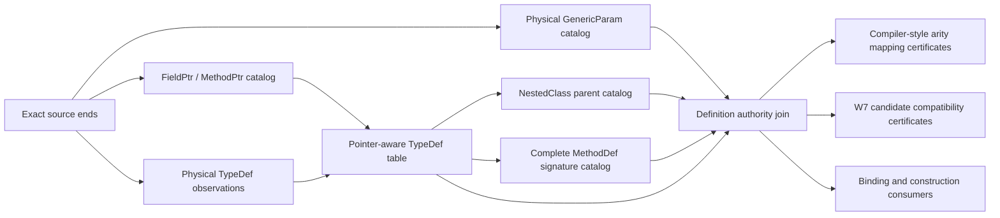

# W8.2 Metadata Authority Cutover

> **Status:** Complete for its defined authority-cutover scope; the checkpoint ledger below is the evidence record.
>
> **Scale:** Realized as additive `~1K LOC` complete-table slices, `~1K–2K LOC` resolution/ancestry portfolios, and a
> net-negative consumer cutover; the original `~10K LOC` consumer estimate is retained as calibration only.
>
> **Scope caveat:** This document governs the w8 metadata authority used by the dump evaluator. It does not
> change frozen W1–W7 contracts or claim that later W8 binding, runtime mapping, evaluation, and portfolio gates have
> landed.

## 1. Purpose

W8 needs one source of truth for TypeDef ownership, nesting, generic parameters, and MethodDef generic declarations.
The first W8 implementation accepted objects whose callers supplied derived list ends, enclosing chains, generic arity, and
owner objects. Those shapes made useful experiments possible, but they allow a caller to assert the same fact that a
later catalog appears to prove. Making the constructors non-public without changing that dependency graph would retain
the circularity.

The cutover replaces those assertions with complete physical row observations and token-only joins. An exact identity
is issued only after every table needed for that identity has complete source-correlated evidence.

## 2. Non-negotiable invariants

1. Physical observations contain physical columns only. They never contain a caller-created TypeDef, MethodDef, parent
   chain, member interval, or generic arity claim.
2. Source ends are checked before complete-table materialization. A bound, incomplete acquisition, or contradiction
   retains no derived row prefix.
3. TypeDef FieldList and MethodList ownership is derived from the complete active list domain. FieldPtr and MethodPtr
   layouts resolve to exact FieldDef and MethodDef token sequences rather than definition-RID intervals.
4. NestedClass is the sole parent-map source. A caller cannot provide an enclosing TypeDef object.
5. GenericParam ownership is the exact tuple `(source, owner kind, owner token)`. Digest equality is not a uniqueness
   key.
6. GenericParam owner sets are derived by grouping the complete physical table. Contiguous owner runs are used only
   after the table has separately proved canonical Owner/Number order.
7. Total TypeDef arity, introduced compiler-style arity, and MethodDef signature arity are distinct facts.
8. The evaluator's per-owner generic-parameter cap is an admission bound, not a physical metadata validity rule.
9. Exact identities have guarded issuers, immutable canonical content, content equality, defensive array accessors, and
   detailed XML documentation.
10. W7 TypeDef and MethodDef objects remain compatibility candidates. They cannot issue W8 authority.

## 3. Authority graph

No edge points from a final or raw caller-authored TypeDef back into a physical catalog.

## 4. Complete-table layers

### 4.1 TypeDef and member-pointer layer

The complete TypeDef table retains each raw row and derives its active FieldList and MethodList intervals. The matching
member-pointer catalog proves that every present pointer table is a complete same-size permutation of its definition
table. Each exact TypeDef row therefore exposes the ordered FieldDef and MethodDef tokens it owns.

The accepted null-list state machine remains physical-order based: a null successor ends the preceding run at the
active table end, leading null rows are empty at RID 1, and trailing null rows are empty at end-plus-one.

### 4.2 NestedClass layer

The complete NestedClass table proves one parent per nested TypeDef, no self relation, no cycles, bounded depth, exact
TypeDef correlation, and the complete parent map. Top-level status is proved by absence from this exact table.

### 4.3 GenericParam physical layer

Each observation retains module, GenericParam token, Number, flags, TypeDef-or-MethodDef owner token, and decoded name.
The catalog validates complete RID coverage, source correlation, owner token range, exact owner/Number uniqueness,
owner position coverage, and applicable owner/name uniqueness.

Coherent unsorted physical input remains admitted. The catalog records whether physical order is canonical by
TypeOrMethodDef coded Owner and then Number, but authority lookup groups the full table by owner in either case.

### 4.4 MethodDef declaration layer

The complete MethodDef projection covers every MethodDef RID, not only methods that own GenericParam rows. It joins
each token to exactly one pointer-aware declaring TypeDef, consumes the complete signature with the shared Core
grammar, and records declared generic arity for static, instance, generic, and non-generic methods.

Method attributes and the signature receiver bit must agree. GenericParam owner-set cardinality and positions are
checked against the decoded signature arity in the definition-authority join.

## 5. TypeDef physical authority

The definition-authority catalog consumes exact results from all four layers. For each TypeDef it issues one physical
identity containing:

- the unchanged TypeDef observation;
- exact FieldDef and MethodDef token ownership;
- the optional enclosing TypeDef token and exact nesting depth;
- the complete TypeDef-owned GenericParam rows ordered by Number;
- total generic arity, including redeclared enclosing parameters for nested types; and
- source lineage proving every join came from the same module content and table ends.

RID 1 must be the actual `<Module>` pseudo-type with its essential shape. A merely non-empty TypeDef table is not
sufficient evidence.

Physical identity does not contain an optional W7 candidate, caller-selected semantic kind, optional ancestry proof,
or compiler mapping status. Those facts belong to separate certificates so two callers cannot produce different
physical identities for the same TypeDef row.

## 6. Physical arity, CLS spelling, and Roslyn projection

The mapping layer derives four separate values:

- total physical arity from the exact TypeDef GenericParam owner set;
- parent total arity from the exact NestedClass relation;
- the non-negative parent-relative delta when one exists; and
- the terminal backtick suffix, if one can be inferred from the current metadata name.

Those values feed four dispositions rather than one overloaded status:

1. **CLS arity spelling** is canonical only when a positive introduced arity has an equal terminal ASCII-decimal
   suffix with no leading zero, while zero introduced arity has no suffix.
2. **Roslyn metadata-name projection** follows the compiler import rule. When introduced arity is positive, Roslyn
   examines the final backtick, requires a nonempty prefix and a 1–5 digit positive suffix no greater than 32767, and
   removes that suffix only when it equals introduced arity. Otherwise Roslyn retains the complete raw name and marks
   it unmangled. An earlier backtick in the retained prefix does not prevent inference of the final suffix.
3. **C# source-name addressability** records whether the projected simple name can be represented by the admitted
   source syntax. A retained raw name containing a backtick is ordinarily not addressable, while a generic physical
   type named plain `G` can remain addressable as Roslyn name `G`, arity 1, and unmangled even though its CLS spelling
   is noncanonical. Reserved keywords use a verbatim `@` spelling, contextual keywords remain directly spellable, and
   metadata names containing Unicode format characters that Roslyn drops while parsing are not exactly addressable.
4. **Evaluator admission** applies operation bounds after the physical and name-projection facts are complete.

A top-level introduced arity equals total arity. A nested introduced arity is `child total - parent total` when that
delta is nonnegative. A nested segment under a generic parent may introduce zero parameters and omit a suffix.
Parameter names are not used to match redeclared positions.

The complete mapping catalog is the sole issuer of mapping identities. It consumes one definition-authority outcome,
selects each TypeDef and its immediate parent from that authority, and emits one RID-ordered mapping outcome per TypeDef.
A non-exact or invalid authority exposes no mapping prefix. A completely projected catalog remains exact when an
individual nested row has a non-exact arity mapping, because the row-level stop is itself the complete derived result.

Malformed suffixes, leading-zero suffixes, suffix/delta disagreement, or `child total < parent total` never erase the
physical TypeDef. They affect only the applicable CLS, Roslyn, source-addressability, or admission disposition.

## 7. Compatibility and consumer cutover

W7 candidates may be compared with an authority-issued TypeDef through a compatibility certificate. The comparison
must use resolved definition-token ownership and therefore distinguishes direct domains from reordered pointer
domains. A W7 interval object cannot establish pointer-domain ownership by itself.

The cutover then removes or changes every public W8 issuer that currently accepts derived claims:

- raw TypeDef construction and direct W7 promotion;
- TypeDef/MethodDef generic-owner construction;
- exact GenericParam row construction;
- TypeDef and method owner-declaration construction from caller-created objects; and
- final TypeDef construction from caller-selected raw identity, kind, generic rows, ancestry, or W7 candidate.

Constraint, FieldSig substitution, TypeRef matching, construction, classification, and binder paths must consume the
authority-issued identities or certificates. Retaining one downstream raw comparison would preserve a bypass.

## 8. Implementation sequence

| Slice | Scale | Exit condition |
|---|---:|---|
| Complete TypeDef member intervals | `~1K LOC` | Exact complete-table intervals with accepted null-list rules |
| Complete NestedClass relations | `~1K LOC` | Exact parent map, cycle/depth checks, guarded relations |
| Complete FieldPtr/MethodPtr mappings | `~1K LOC` | Resolved member tokens for direct and reordered domains |
| Physical GenericParam catalog | `~1K LOC` | Token-only owners, full-table grouping, explicit order profile |
| Complete MethodDef declaration catalog | `~1K LOC` | Pointer-aware owner and complete shared-grammar signature facts |
| Definition authority and mapping certificates | `~10K LOC` | Module row, owner arities, nested mapping, guarded issuance |
| Public-issuer removal and consumer migration | `~10K LOC` | No caller-authored W8 authority path remains |
| Documentation and closure reconciliation | `~1K LOC` | Catalogs, tests, traceability, and status agree |

These are order-of-magnitude estimates and may be revised when implementation evidence changes the apparent volume.

### 8.1 Consumer migration clusters

The consumer cutover proceeds in dependency order, but every cluster includes all consumers that can be migrated once
its inputs exist:

1. **Authority-derived certificates (`~1K LOC`).** Complete the TypeDef/W7 candidate comparison and authority-owned
   GenericParam owner and binding facts after the landed compiler-name mapping catalog. Candidate objects remain
   comparison inputs only.
2. **Generic ownership, constraints, and substitution (`~10K LOC`).** Replace caller-created generic owners, rows,
   declarations, method certificates, and the legacy GenericParam catalog with physical rows selected through the
   definition authority. Migrate constraint edges/sets, argument bindings, and field substitution together so no raw
   owner comparison remains between them.
3. **TypeDef-or-Ref, token resolution, and signature trees (`~10K LOC`).** Derive every outer-to-inner TypeDef chain by
   following authority parent tokens. Named signature nodes retain authority rows, authority-bound mappings, and
   separate semantic certificates rather than one final caller-created TypeDef object.
4. **Ancestry, interfaces, construction, and classification (`~10K LOC`).** First normalize exact per-module authority
   and compatibility catalogs into one bounded same-snapshot portfolio, because ordinary application ancestry crosses
   into the runtime core library. Then retype base/interface edges, construction segments, closed types, type-use
   results, semantic classification, and Nullable interpretation around the same authority chain and constructed
   argument vector. Classify the selected `System.ValueType`, `System.Enum`, `System.Delegate`, and
   `System.MulticastDelegate` role definitions themselves as classes; derive value-type, enum, or delegate semantics
   only from an exact immediate base-role edge.
5. **Issuer deletion and producer integration (`~10K LOC`).** Delete raw TypeDef promotion, caller-created generic
   owner/row/declaration factories, the W7-backed method certificate, final TypeDef factories, and every remaining W8
   compatibility facade. Then connect the metadata producer directly to the complete catalogs and rerun the complete
   W1-W8 matrix.

No cluster is a permanent compatibility layer. A legacy issuer remains only while a later cluster still has a compiled
consumer, and its final consumer migration and deletion land in the same checkpoint.

## 9. Synthetic verification matrix

The authority tests use complete synthetic modules large enough to exercise interactions rather than isolated scalar
examples:

- direct, FieldPtr-only, MethodPtr-only, and combined reordered member domains;
- a top-level generic type, a nested zero-introduction segment, and a deeper segment introducing parameters;
- interleaved unsorted TypeDef-owned and MethodDef-owned GenericParam rows;
- static and instance generic methods plus non-generic methods in the same table;
- a 65-parameter owner that stays physically exact but crosses evaluator admission;
- missing, duplicate, gapped, foreign-source, wrong-table, and out-of-range evidence;
- malformed and trailing MethodDef signature bytes and receiver disagreement;
- module pseudo-type violations, nesting cycles, arity underflow, and name-suffix disagreement;
- canonical ``G`1``, plain generic `G`, mismatched ``G`2``, ``G`0``, ``G`01``, empty-prefix, non-ASCII digit,
  trailing-backtick, 32767/32768 boundary, and multiple-backtick Roslyn projection cases;
- exact-cap and cap-plus-one boundaries, including physical RID/end sentinels;
- canonical replay, mutation attempts, equality/hash, reflection issuer scans, and emitted XML documentation; and
- frozen W1–W7 canonical artifact and complete zero-skip headless regression lanes.

## 10. Landed checkpoint ledger

| Commit | Result |
|---|---|
| `a53ea4dc6` | FieldDef substitution is anchored to exact source and table proofs. |
| `172824d7d` | Complete TypeDef rows derive accepted FieldList and MethodList intervals. |
| `fac073ae9` | Complete NestedClass rows derive the exact parent map. |
| `5c90f1b4b` | Complete member-pointer tables resolve TypeDef ownership to definition tokens. |
| `fd92ab415` | Complete physical GenericParam and MethodDef catalogs derive owner groups and decoded declaration facts. |
| `2ba2db3dd` | Exact Param and ParamPtr source ends join the MethodDef catalog to the complete metadata source identity. |
| `3de41dce4` | The definition-authority join issues TypeDef and MethodDef authority rows, and independent compiler-name facts cover CLS spelling, Roslyn projection, C# spelling, and evaluator admission. |
| `122b78cfe` | Compiler-name mappings are issued only from complete definition authority and retain fixed-size TypeDef and parent references. |
| `0bba62c67` | Optional deterministic bounds use one shared canonical encoder across authority, table, and construction contracts. |
| `c808f1fea` | Complete RID-ordered certificates compare W7 TypeDef candidates with authority rows and resolved member ownership. |
| `64bae81d7` | GenericParam owner groups and binding ledgers are issued from definition authority with separate 64/65 admission. |
| `aa6cbde7c` | The complete GenericParamConstraint table resolves Owner through GenericParam authority while retaining unresolved physical targets. |
| `008a76c0a` | Field substitution requires a compatible W7 candidate certificate and the authority-owned GenericParam binding ledger for the declaring TypeDef. |
| `cdd1b3ec3` | Exact per-module compatibility catalogs normalize into one bounded, deterministic, same-snapshot portfolio without changing row outcomes. |
| `eb36593f0` | Constraint edges, sets, and type-use results consume catalog-issued physical constraint evidence, and the public constraint-edge issuer is removed. |
| `415b7355a` | Complete physical TypeRef, ModuleRef, TypeSpec, AssemblyRef, File, and ExportedType tables and authority-derived named-TypeDef chains issue guarded reference rows, coded-index range proofs, and one normalized multi-module chain portfolio. |
| `626ea9226` | The TypeRef resolution portfolio resolves every physical TypeRef row across modules through Module, nested-parent, AssemblyRef, and bounded forwarder paths with complete typed row dispositions. |
| `59da9fed0` | The ancestry portfolio selects the exact physical core roles, derives every immediate-base edge, classifies TypeDef semantics only from exact immediate base-role edges, and walks bounded cross-module ancestry chains. |
| `4bf08141f` | Constraint targets join their exact same-module, cross-module, or retained-TypeSpec authority evidence through the resolution portfolio with identical source-end lineage. |
| `d4d5f745c` | Every caller-authored issuer is deleted: raw and classified TypeDef identities, W7 promotion, caller-created generic owner/row/declaration/owner-set/binding-ledger factories, the W7-backed method certificate, the caller-composed base edge, and the legacy delegate-ancestry proof. TypeSpec, closed-type, and interface-edge machinery is retyped onto classification and resolution rows with seven advanced canonical schemas, and an assembly-wide reflection guard enforces the boundary. |

The multi-module ancestry and semantic-role slice and the issuer cutover are landed: TypeRef target resolution,
core-role selection, immediate-base edges, semantic classification, bounded ancestry, the constraint-target join, and
the retyped construction surface are all issued by guarded portfolios over one authority lineage. Indirect role
derivation and caller-authored authority claims are impossible by construction, and W7 objects remain comparison
candidates only. Generic TypeSpec bases and TypeSpec constraint targets remain retained signature rows for the later
constructed-substitution work. The consumer cutover realized as a net deletion rather than the estimated `~10K LOC`
addition because repository-wide search proved the legacy chain had no production consumers.

The metadata-authority contract families defined by this plan are complete. The host-owned producer that materializes
these catalogs from real dump metadata, and the V2 binder that consumes them, land with the W8.3+ projection and
binding checkpoints of the [Post-W7 Path Forward](post-w7-path-forward.md); they are product work, not authority
cutover work.

## 11. Exit gate

The authority cutover is complete only when:

1. every exact TypeDef, GenericParam row, GenericParam owner, and generic MethodDef declaration is catalog-issued;
2. all table joins prove identical source lineage and expose no prefix after a non-exact or invalid result;
3. unsorted coherent GenericParam layouts and reordered member-pointer layouts work without heuristics;
4. total, introduced, name-spelled, signature, CLS, Roslyn-projection, source-addressability, and admission facts cannot
   be conflated;
5. W7 objects are compatibility candidates only;
6. downstream substitution, constraint, construction, classification, and binding code has no caller-authored bypass;
7. assembly-wide reflection tests reject public exact-row issuers outside the owning catalogs;
8. complex synthetic, canonical, XML, formatting, workflow, unit, and integration gates pass headlessly with zero skips;
   and
9. the plan, interface catalog, testing strategy, integration plan, and traceability map describe the exact landed
   boundary without claiming later W8 product behavior.
